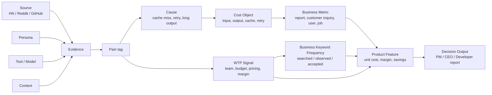

# Token Cost Ontology

이 온톨로지는 "커뮤니티 evidence가 어떤 제품 기능으로 이어지는가"를 작게 추적하기 위한 구조다. 지금은 앱 화면이 아니라 제품 판단 문서로 사용한다.

## 제품 정의

토큰 시뮬레이터는 토큰 수를 세는 계산기가 아니라, AI 기능의 원가, 마진, 가격정책을 해석해주는 도구다. 온톨로지는 이 제품 정의를 evidence와 기능 우선순위로 연결하기 위한 구조다.

## 핵심 엔티티

| 엔티티 | 의미 | 예시 |
| --- | --- | --- |
| Source | 반응이 나온 채널 | Hacker News, Reddit, GitHub issue |
| Evidence | 커뮤니티 글, GitHub issue, 공개 사례 | EV-007 Reddit cache bug |
| Persona | 문제를 말한 사람 유형 | solo dev, startup CTO, infra engineer, PM |
| Tool | 사용 중인 도구/모델/provider | Claude Code, Cursor, LiteLLM, Anthropic |
| Context | 문제가 발생한 상황 | 개인 사용, 팀 사용, production, enterprise |
| Pain | 사용자가 겪는 문제 유형 | `pain_tracking_wrong` |
| Cause | pain이 생기는 직접 원인 | cache miss, tool output 누적, provider별 가격 차이 |
| Cost Object | 비용이 붙는 대상 | input token, output token, cache write, retry |
| Business Metric | 사용자가 직접 입력하는 비즈니스 기준값 | 월 처리 건수, 월 리포트 수, 월 고객 수 |
| Product Feature | MVP에서 pain을 줄이는 기능 | CSV import, 기능별 비용 Top, 원가/마진 |
| WTP Signal | 구매 가능성을 높이는 신호 | team, budget, production, customer, margin |
| Business Keyword Frequency | business keyword가 후보군에서 얼마나 자주 보였는지 | cost per customer 후보 12개, 채택 6개 |
| Competitor | 대체재 또는 비교 대상 | Langfuse, Helicone, Portkey, LiteLLM |
| Decision Output | 공유 가능한 결론 | PM 요약, CEO 절감액, 개발자 breakdown |

## 관계

## 관계 정의

| Relationship | 예시 |
| --- | --- |
| `Evidence expresses Pain` | EV-010은 `pain_tracking_wrong`을 표현한다. |
| `Pain occurs_in Context` | `pain_team_budget`은 team/production context에서 강하다. |
| `Pain caused_by Cause` | 비용 예측 불가는 feature mapping 부재 때문에 생긴다. |
| `Persona experiences Pain` | startup CTO가 `pain_margin_unknown`을 겪는다. |
| `Pain implies Product Feature` | `pain_margin_unknown`은 기능별 원가/마진 리포트를 요구한다. |
| `Product Feature measured_by Business Metric` | Margin Report는 gross margin, cost per customer로 측정된다. |
| `WTP Signal validates Pain` | "budget exceeded", "gross margin"은 구매 신호가 강하다. |
| `Competitor covers Feature` | LiteLLM은 proxy/cost tracking을 커버하지만 business margin report는 별도 검증이 필요하다. |

## 현재 MVP가 직접 해결하는 pain

- `pain_cost_unpredictable`: 월 비용, 연 비용, 기능별 비용 Top으로 비용이 어디서 발생하는지 보여준다.
- `pain_provider_compare`: 현재 모델과 후보 모델의 비용/품질/리스크를 함께 비교한다.
- `pain_margin_unknown`: 사용자가 입력한 월 처리량과 판매가로 단위 원가와 gross margin을 계산한다.
- `pain_quality_tradeoff`: raw cost와 effective cost를 분리해 싼 모델이 진짜 싼지 판단하게 한다.
- `pain_tracking_wrong`: 현재는 별도 진단 화면보다 CSV import와 계산 검증으로 먼저 해결한다.

## 근거가 더 필요한 기능

- `pain_team_budget`: 예산/쿼터 가드레일은 archive에 백업한다. 50개 evidence에서 Top 3와 WTP 평균 4 이상일 때만 복귀한다.
- `pain_limit_confusion`: quota 숫자 불일치는 강한 불만이지만, 이 앱이 provider quota를 직접 해결할 수 있는지는 아직 불확실하다.
- `pain_token_waste`: 개발자 진단 화면은 Top pain 검증 후 별도 기능으로 재검토한다.

## 현재 pilot에서 드러난 주의점

10개 pilot은 developer tooling evidence가 많아서 `pain_tracking_wrong`, `pain_cost_unpredictable`, `pain_token_waste`가 강하게 나온다. 하지만 제품 정의의 가장 강한 B2B 축은 `pain_margin_unknown`과 `pain_quality_tradeoff`다. 따라서 50개 v1에서는 AI SaaS, usage-based pricing, cost per customer, gross margin, Finance/PM/CEO 표현이 들어간 evidence를 의도적으로 더 모아야 한다.

## Product Reflection 규칙

1. Evidence는 `docs/research/evidence_board.csv`에 먼저 들어간다.
2. Pain tag와 score는 validation script로 검증한다.
3. Top Pain 3개가 현재 MVP와 맞으면 README와 보고서 문구에 반영한다.
4. 맞지 않으면 UI 기능을 바로 추가하지 않고 우선순위 문서부터 업데이트한다.
