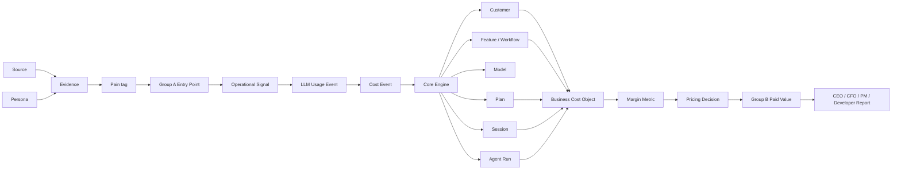

# AI SaaS Cost Ontology

이 온톨로지는 Evidence Board의 사례가 어떤 MVP 기능과 제품 판단으로 이어지는지 추적하기 위한 구조다. 앱 화면이 아니라 제품 의사결정 문서로 사용한다.

## 제품 정의

토큰 시뮬레이터는 토큰 수를 세는 계산기가 아니다. LLM 운영 로그를 고객·기능·모델·플랜·세션 단위 원가로 재분류하고, AI SaaS의 마진과 가격정책 판단으로 연결하는 워크스페이스다.

핵심 구조는 3층이다.

> Group A는 entry point, Core Engine은 비용 귀속 레이어, Group B는 paid value다.

```txt
Group A: Entry Point
실시간 비용/운영 문제
        ↓
Core Engine
비용 귀속 / 원인 분해 / 비즈니스 단위 변환
        ↓
Group B: Paid Value
마진/가격/수익성 의사결정
```

중심 질문은 "토큰을 얼마나 썼나?"가 아니라 "이 사용량이 어떤 고객, 기능, 모델, 플랜, 세션, 마진, 가격 문제로 이어지는가?"다.

## 핵심 흐름

```txt
LLM Usage Event
-> Cost Event
-> Attribution Dimension
-> Business Cost Object
-> Margin Metric
-> Pricing Decision
```

예시:

```txt
agent loop 발생
-> output token 증가
-> session cost 증가
-> 특정 customer / feature / plan에 귀속
-> customer 또는 plan gross margin 하락
-> heavy user cap, overage, usage-based pricing, credit policy 검토
```

## 핵심 엔티티

| 엔티티 | 의미 | 예시 |
| --- | --- | --- |
| Source | evidence가 나온 채널 | Reddit, HN, GitHub, SaaS CFO blog |
| Evidence | URL, 날짜, quote가 있는 사례 | GR-024 RevOps heavy-user margin 사례 |
| Persona | 문제를 말한 사람 | developer, founder, CFO, CEO, Finance, PM |
| Operational Signal | Group A에서 보이는 운영 문제 | token spike, cache miss, quota, agent loop, provider delay |
| LLM Usage Event | 실제 호출 단위 로그 | request_id, timestamp, input/output tokens, model |
| Cost Event | usage event에서 계산된 비용 | input cost, output cost, cached cost, total_cost |
| Attribution Dimension | 비용을 묶는 기준 | customer, feature, model, plan, session, agent run |
| Customer | 비용과 매출이 귀속되는 고객/계정 | enterprise customer, tenant, org |
| Feature / Workflow | 비용이 발생한 제품 기능 | RAG chat, document summary, report generation |
| Model | 호출에 사용한 모델 | Claude Sonnet, Gemini Flash, GPT |
| Plan | 가격정책/상품 패키지 | Free, Pro, Team, Enterprise, AI add-on |
| Session | 대화/작업 세션 | support conversation, coding session, analysis run |
| Agent Run | 여러 LLM 호출이 묶인 실행 단위 | report agent run, research workflow |
| Business Cost Object | 비즈니스 원가 단위 | customer, report, ticket, workflow, transaction |
| Revenue Unit | 고객에게 가격을 매기는 단위 | seat, report, ticket, workflow, AI credit |
| Margin Metric | 수익성 지표 | gross margin, contribution margin, effective margin |
| Pricing Model | 가격정책 구조 | seat, usage-based, credit, hybrid, cap, overage |
| Heavy User Segment | 평균보다 훨씬 많이 쓰는 고객군 | top-decile user, power user, whale |
| Pain | 제품 의사결정에 연결되는 문제 | `pain_usage_pricing_mismatch` |
| Product Feature | MVP가 제공하는 해결 표면 | attribution engine, pricing simulator, margin report |
| Decision Output | 공유 가능한 결론 | PM 요약, CEO margin summary, developer breakdown |

## 관계


```mermaid
flowchart LR
  Source["Source"] --> Evidence["Evidence"]
  Persona["Persona"] --> Evidence
  Evidence --> Pain["Pain tag"]

  Pain --> Entry["Group A Entry Point"]
  Entry --> Signal["Operational Signal"]
  Signal --> Usage["LLM Usage Event"]
  Usage --> Cost["Cost Event"]

  Cost --> Engine["Core Engine"]
  Engine --> Customer["Customer"]
  Engine --> Feature["Feature / Workflow"]
  Engine --> Model["Model"]
  Engine --> Plan["Plan"]
  Engine --> Session["Session"]
  Engine --> AgentRun["Agent Run"]

  Customer --> CostObject["Business Cost Object"]
  Feature --> CostObject
  Plan --> CostObject
  Session --> CostObject
  AgentRun --> CostObject

  CostObject --> Margin["Margin Metric"]
  Margin --> Pricing["Pricing Decision"]
  Pricing --> Paid["Group B Paid Value"]
  Paid --> Output["CEO / CFO / PM / Developer Report"]
```

## 관계 정의

| Relationship | 의미 | 예시 |
| --- | --- | --- |
| `Evidence expresses Pain` | evidence가 어떤 pain을 말하는지 연결한다. | GR-024는 heavy user가 margin을 깨는 사례다. |
| `Pain enters via Operational Signal` | 개발자가 체감하는 운영 문제가 entry point가 된다. | token spike, cache miss, agent loop. |
| `Usage creates Cost Event` | 호출 로그가 비용 이벤트로 바뀐다. | input/output token과 모델 단가로 total cost 계산. |
| `Cost attributed_to Dimension` | 비용을 고객/기능/모델/플랜/세션/agent run으로 묶는다. | 특정 enterprise plan의 RAG session 비용. |
| `Dimension maps_to Business Cost Object` | attribution 결과를 비즈니스 단위 원가로 바꾼다. | report 1개 원가, customer 1명 월 AI 원가. |
| `Cost compared_with Revenue Unit` | 원가를 판매 가격 단위와 비교한다. | Enterprise plan included usage vs AI COGS. |
| `Margin informs Pricing Model` | margin 결과가 가격정책 선택으로 이어진다. | flat seat에서 hybrid/credit/usage로 전환한다. |
| `Product Feature produces Decision Output` | MVP 기능이 공유 가능한 결론을 만든다. | CEO용 월 margin risk summary. |

## 3층 Pain 연결

| 레이어 | 연결 pain | 제품 의미 |
| --- | --- | --- |
| Entry Point | `pain_cost_unpredictable`, `pain_token_waste`, `pain_tracking_wrong`, `pain_limit_confusion` | 개발자가 로그를 가져오고 원인을 보고 싶어지는 이유 |
| Core Engine | `pain_feature_cost_unknown`, `pain_customer_profitability_unknown`, `pain_ai_cogs_untracked`, `pain_provider_compare`, `pain_quality_tradeoff` | 비용을 고객·기능·모델·플랜·세션 단위로 귀속하는 해석 엔진 |
| Paid Value | `pain_margin_unknown`, `pain_heavy_user_loss`, `pain_usage_pricing_mismatch`, `pain_board_reporting_gap` | 회사가 돈을 낼 마진·가격·보고 의사결정 |

## 현재 MVP가 직접 해결하는 Pain

- `pain_cost_unpredictable`: CSV usage와 usage/spike 요약으로 비용이 어디서 튀는지 진입점을 만든다.
- `pain_feature_cost_unknown`: CSV usage를 기능별로 묶고 비용 Top을 보여준다.
- `pain_customer_profitability_unknown`: customer_id와 business denominator로 고객별·단위별 원가를 계산한다.
- `pain_ai_cogs_untracked`: LLM usage를 AI COGS와 margin report로 분리한다.
- `pain_margin_unknown`: 판매가와 원가를 비교해 gross margin을 계산한다.
- `pain_heavy_user_loss`: high-usage 고객/플랜이 마진을 깨는지 분석한다.
- `pain_usage_pricing_mismatch`: seat, usage, credit, hybrid, cap, overage 시뮬레이션의 근거가 된다.
- `pain_quality_tradeoff`: raw cost와 effective cost를 나눠 싼 모델이 진짜 싼지 판단한다.

## Research-Gated 기능

- 예산/쿼터 가드레일: `pain_team_budget` 또는 `pain_cost_unpredictable`의 WTP가 충분히 높을 때 복귀한다.
- 개발자 진단: `pain_tracking_wrong` 또는 `pain_token_waste`가 Top pain으로 유지될 때 별도 화면으로 검토한다.
- SDK / Middleware: CSV import가 실제 팀 데이터로 반복 검증된 뒤 자동 수집 단계로 확장한다.
- Gateway / Proxy: 장기적으로 비용 기록, 라우팅, 제한, fallback까지 담당한다.
- Slack/Email 알림: alert 이후 action이 명확한 팀에서만 유료 기능 후보로 올린다.

## MVP 우선순위

| 우선순위 | 기능 | 연결 레이어 |
| --- | --- | --- |
| P0 | CSV usage import | Entry Point |
| P0 | usage/spike 요약 | Entry Point |
| P0 | 고객별 비용 | Core Engine |
| P0 | 기능별 비용 | Core Engine |
| P0 | 모델별 비용 | Core Engine |
| P0 | 플랜별 비용 | Core Engine |
| P0 | 세션/agent run별 비용 | Core Engine |
| P0 | 고객별 수익성 | Paid Value |
| P0 | 플랜별 gross margin | Paid Value |
| P0 | heavy-user profitability | Paid Value |
| P0 | usage-based / credit / hybrid / cap / overage simulation | Paid Value |
| P0 | CEO/CFO/PM/Developer report | Paid Value |
| P1 | raw cost vs effective cost | Core Engine / Paid Value |
| P1 | invoice vs internal usage reconciliation | Core Engine |

## Product Reflection 규칙

1. Evidence는 먼저 [evidence_board.csv](evidence_board.csv)에 들어간다.
2. `pain_tag`, `frequency_signal`, `wtp_score`, `quote_verified`는 validator로 검증한다.
3. `quote_verified=false`인 evidence는 제품 주장에 쓰지 않고 후보로만 둔다.
4. Top Pain이 현재 MVP와 맞으면 README와 보고서 문구에 반영한다.
5. 맞지 않으면 UI 기능을 바로 추가하지 않고 우선순위 문서부터 업데이트한다.
