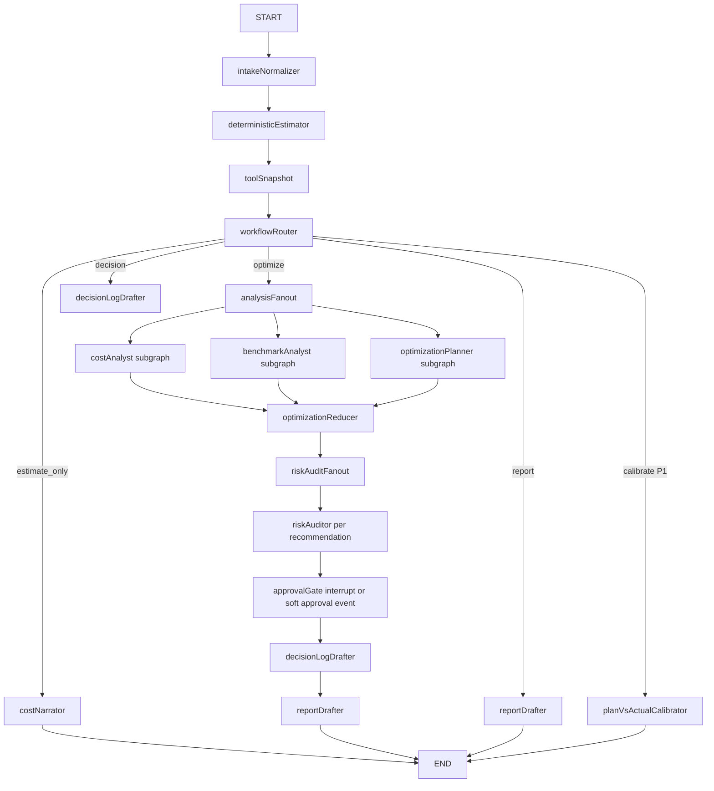

# AI Team Cost Agent Architecture 구현 계획

> **에이전트 작업자 필수 지침:** 이 계획을 구현할 때는 `superpowers:subagent-driven-development`를 권장한다. 대안으로 `superpowers:executing-plans`를 사용해도 된다. 각 단계는 체크박스(`- [ ]`) 기준으로 추적한다.

**목표:** `2026-05-22-ai-team-cost-simulator-prd.md`의 Wedge A를 구현한다. 즉, 사용자가 AI 팀의 각 Agent 입력/출력 명세를 정의하면 deterministic 엔진이 비용을 계산하고, LangGraph.js agent들이 그 결과를 해석, 최적화, 리스크 감사, Decision Log 초안 작성까지 수행한다.

**아키텍처:** 시스템은 크게 두 층으로 나눈다. 첫 번째는 deterministic cost tool layer다. 여기서 `AgentSpec`과 `Artifact`를 월간 토큰 추정치로 바꾸고, 반드시 `src/lib/calculator.ts` 재수출 경로의 `calculateCost`로 비용을 계산한다. 두 번째는 LangGraph.js orchestration layer다. 이 graph는 tool snapshot을 먼저 만들고, 분석 subgraph들을 병렬 실행한 뒤, 최적화 추천은 Risk Auditor와 승인 게이트를 직렬로 통과시킨다.

**기술 스택:** Vite 6, React 18, TypeScript 5, Vitest, `@langchain/langgraph` 1.x, 기존 `src/lib/calculator.ts`, 기존 `src/lib/format.ts`, 현재는 Vercel Functions shell, 이후 Next.js Route Handler.

---

## 1. PRD 해석

이 PRD는 Wedge A다. 즉 운영 후 usage log를 분석하는 Wedge B가 아니라, 운영 시작 전에 “AI 팀을 이렇게 구성하면 한 달에 얼마 드는가?”를 시뮬레이션하는 pre-flight 도구다.

핵심 흐름은 아래와 같다.

```txt
AgentSpec + Artifact I/O + Frequency
  -> token workload estimate
  -> src/lib/calculator.ts의 calculateCost
  -> bottleneck / optimization candidate
  -> agent interpretation / risk audit / approval / decision log
```

절대 불변식:

```txt
Agent는 설명, 비교, 추천, 리포트, Decision Log 초안을 작성할 수 있다.
Agent는 비용, 마진, 토큰 수치를 직접 계산하거나 만들어내면 안 된다.
모든 숫자는 deterministic tool ref에서만 나온다.
```

현재 repo에 이미 있는 기반:

- `@langchain/langgraph` 설치 완료.
- P0 graph skeleton: `src/features/agent/lib/agentGraph.ts`.
- browser/server runtime switch: `src/features/agent/lib/agentRuntime.ts`.
- P1 Vercel Functions shell: `src/server/p1ApiHandlers.ts`, `api/*`.
- Risk Card corpus.
- Decision Log primitives.

Wedge A 구현에서 아직 필요한 핵심:

- `AgentSpec` / `Artifact` schema.
- Artifact token template library.
- PRD의 9-agent catalog.
- `AgentSpec -> CalcInput -> calculateCost` mapper.
- 팀 전체 비용 요약과 병목 탐지.
- 최적화 후보 생성 엔진.
- Wedge A 전용 LangGraph graph: router, parallel branches, serial risk/approval flow, subagents.

---

## 2. LangChain 1.0 / LangGraph 사용 결정

결론: **Python LangChain 서비스가 아니라 LangGraph.js `StateGraph`를 직접 사용한다.**

이유:

- 현재 deterministic cost core가 TypeScript다.
- 프로젝트 헌법상 모든 비용 계산은 `src/lib/calculator.ts` 경로를 통과해야 한다.
- Python 서비스를 따로 두면 `AgentSpec -> token estimate -> calculateCost` 단일 경로가 찢어진다.
- LangGraph.js는 명시적 state, router, 병렬 branch, subgraph, human approval gate를 구현하기에 충분하다.

LangChain 생태계 사용 방식:

- P0: `@langchain/langgraph` `StateGraph`를 browser에서 실행한다. LLM key가 없어도 deterministic fallback narrative를 반환한다.
- P1: 같은 graph contract를 `/api/team-cost-agent` 뒤로 옮긴다. provider key는 서버에서 보관한다.
- Next.js 이전 후: `api/*.ts` wrapper를 `app/api/*/route.ts`로 옮긴다. graph와 deterministic lib는 최대한 그대로 둔다.

Python LangChain 1.0의 supervisor/subagent 패턴은 설계 참고로만 사용한다. 실제 구현은 JS graph/subgraph 중심으로 간다.

---

## 3. 전체 Graph 구조

### 3.1 Top-Level Flow



### 3.2 왜 이 구조인가

- **앞부분은 직렬:** intake normalization과 deterministic estimation은 어떤 agent 해석보다 먼저 실행한다. 그래야 숫자의 출처가 고정된다.
- **중간은 라우터:** 사용자의 UI action 또는 workflow mode에 따라 경로를 정한다. LLM에게 “어느 경로로 갈지”를 맡기지 않는다.
- **분석은 병렬:** Cost Analyst, Benchmark Analyst, Optimization Planner는 같은 tool snapshot을 읽기만 하므로 병렬 실행 가능하다.
- **최적화 이후는 직렬:** Risk Auditor는 추천안이 있어야 실행 가능하고, approval은 Risk Auditor 결과가 있어야 가능하다.
- **추천별 risk audit은 동적 병렬:** 추천 수가 매번 달라지므로 `Send` 기반 dynamic fan-out을 쓴다.

---

## 4. State 설계

생성 파일:

`src/features/team-cost/lib/teamCostState.ts`

```ts
import type { AgentSpec } from './agentSpec'
import type { TeamCostEstimate, AgentCostEstimate } from './estimateAgentWorkload'
import type { BottleneckFinding } from './bottleneckAnalysis'
import type { OptimizationCandidate, OptimizationRecommendation } from './optimizationPolicies'
import type { BenchmarkMatch } from './benchmarkCorpus'
import type { RiskCard } from '../../agent/lib/riskCards'
import type { DecisionInput } from '../../decision-log/lib/decisionLog'
import type { ToolResultRef, ToolValue } from '../../agent/lib/toolContract'

export type TeamCostWorkflowMode =
  | 'estimate_only'
  | 'optimize'
  | 'decision'
  | 'report'
  | 'calibrate'

export interface TeamCostGraphEvent {
  type:
    | 'tool_snapshot'
    | 'cost_analysis'
    | 'benchmark_analysis'
    | 'optimization_candidate'
    | 'risk_audit'
    | 'approval_required'
    | 'decision_draft'
    | 'report_draft'
    | 'calibration'
  message: string
  toolResultRefs: ToolResultRef[]
  riskCardIds: string[]
  recommendationIds: string[]
}

export interface TeamCostGraphState {
  workflowMode: TeamCostWorkflowMode
  companyProfile: {
    companyType: string
    stage: string
    monthlyBudgetUsd: number
    locale: 'en' | 'ko'
  }
  agentSpecs: AgentSpec[]
  estimates: AgentCostEstimate[]
  teamEstimate: TeamCostEstimate | null
  toolRefs: ToolResultRef[]
  toolValues: Partial<Record<ToolResultRef, ToolValue>>
  bottlenecks: BottleneckFinding[]
  benchmarks: BenchmarkMatch[]
  candidates: OptimizationCandidate[]
  recommendations: OptimizationRecommendation[]
  riskCardsByRecommendation: Record<string, RiskCard[]>
  approval: {
    status: 'not_required' | 'pending' | 'approved' | 'rejected'
    recommendationId: string | null
  }
  decisionDraft: DecisionInput | null
  events: TeamCostGraphEvent[]
}
```

Reducer 규칙:

- `events`: append-only.
- `toolRefs`: append 후 중복 제거.
- `toolValues`: ref 기준 merge. non-finite 값으로 기존 값을 덮어쓰지 않는다.
- `recommendations`: `id` 기준 merge.
- `riskCardsByRecommendation`: recommendation id 기준 merge.

---

## 5. Deterministic Tool Layer

### 5.1 생성할 파일

```txt
src/features/team-cost/lib/agentSpec.ts
src/features/team-cost/lib/agentSpec.test.ts
src/features/team-cost/lib/artifactTemplates.ts
src/features/team-cost/lib/artifactTemplates.test.ts
src/features/team-cost/lib/agentCatalog.ts
src/features/team-cost/lib/agentCatalog.test.ts
src/features/team-cost/lib/estimateAgentWorkload.ts
src/features/team-cost/lib/estimateAgentWorkload.test.ts
src/features/team-cost/lib/bottleneckAnalysis.ts
src/features/team-cost/lib/bottleneckAnalysis.test.ts
src/features/team-cost/lib/optimizationPolicies.ts
src/features/team-cost/lib/optimizationPolicies.test.ts
src/features/team-cost/lib/benchmarkCorpus.ts
src/features/team-cost/lib/benchmarkCorpus.test.ts
src/features/team-cost/lib/teamCostState.ts
```

### 5.2 Core Types

```ts
import type { Model } from '../../alternatives/data/models'

export type HumanReviewGate = 'none' | 'sample' | 'all'

export type Frequency =
  | { unit: 'day'; count: number }
  | { unit: 'week'; count: number }
  | { unit: 'month'; count: number }
  | { unit: 'customer'; count: number; denominatorCount: number }
  | { unit: 'document'; count: number; denominatorCount: number }

export interface Artifact {
  id: string
  name: string
  kind: string
  estTokens: number
  reusedEachRun: boolean
  size: 'short' | 'medium' | 'long'
}

export interface AgentSpec {
  id: string
  role: string
  modelId: string
  inputs: Artifact[]
  outputs: Artifact[]
  callsPerRun: number
  retryRate: number
  cacheHitRate: number
  batchEnabled: boolean
  humanReviewGate: HumanReviewGate
  assignedTasks: string[]
  frequency: Frequency
}

export interface AgentWorkloadInput {
  spec: AgentSpec
  model: Model
}
```

### 5.3 비용 추정 공식

```ts
runsPerMonth = normalizeFrequencyToMonthlyRuns(spec.frequency)
inputTokensPerRun = sum(spec.inputs.estTokens)
outputTokensPerRun = sum(spec.outputs.estTokens)
retryMultiplier = 1 + clamp(spec.retryRate, 0, 1)

monthlyInputTokens =
  inputTokensPerRun * spec.callsPerRun * retryMultiplier * runsPerMonth

monthlyOutputTokens =
  outputTokensPerRun * spec.callsPerRun * retryMultiplier * runsPerMonth

monthlyRequests =
  spec.callsPerRun * retryMultiplier * runsPerMonth

calculateCost({
  model,
  monthlyInputTokens,
  monthlyOutputTokens,
  monthlyRequests,
  cacheHitRate: spec.cacheHitRate,
  batchEnabled: spec.batchEnabled,
})
```

구현 규칙:

```ts
import { calculateCost } from '../../../lib/calculator'
```

새 Wedge A 코드는 `src/domain/cost/calculator.ts`를 직접 import하지 않는다. 프로젝트 헌법상 public calculation path는 `src/lib/calculator.ts`다.

---

## 6. Agent Tool Contract

생성 파일:

`src/features/agent/lib/teamCostToolContract.ts`

stable refs:

```ts
export type TeamCostToolRef =
  | 'tool:team.monthlyCostUsd'
  | 'tool:team.monthlyInputTokens'
  | 'tool:team.monthlyOutputTokens'
  | 'tool:team.monthlyRequests'
  | 'tool:team.cacheSavingsUsd'
  | 'tool:team.batchSavingsUsd'
  | 'tool:team.topAgentId'
  | 'tool:team.topAgentShare'
  | `tool:agent.${string}.monthlyCostUsd`
  | `tool:agent.${string}.monthlyInputTokens`
  | `tool:agent.${string}.monthlyOutputTokens`
  | `tool:agent.${string}.costShare`
  | `tool:bottleneck.${string}.severity`
  | `tool:optimization.${string}.monthlySavingsUsd`
  | `tool:optimization.${string}.costAfterUsd`
  | `tool:benchmark.${string}.ratio`
```

snapshot 규칙:

- finite number만 포함한다.
- 빈 문자열은 제외한다.
- 배열은 모든 item이 string일 때만 포함한다.
- raw prompt, API key, 업로드 문서 원문은 snapshot에 넣지 않는다.
- 모든 agent event와 report section은 `toolResultRefs`를 가져야 한다.

---

## 7. Subagent 설계

### 7.1 Team Intake Architect

역할:

- 회사/업무 선택을 editable `AgentSpec` 기본값으로 변환한다.
- P0에서는 static 9-agent catalog를 우선 사용한다.
- P1에서는 LLM이 누락 agent를 제안할 수 있지만, user가 승인하기 전까지 draft로만 렌더한다.

입력:

- company type
- stage
- monthly budget
- selected tasks
- frequency hints

출력:

- `AgentSpec[]`
- deterministic validation 이후 `tool_snapshot` event

금지:

- LLM이 token/cost math를 직접 하면 안 된다.

### 7.2 Cost Analyst Subgraph

역할:

- deterministic team cost와 병목을 설명한다.
- top agent, 큰 reused input, retry/calls-per-run 위험, budget overage를 강조한다.

읽을 수 있는 tool refs:

- `tool:team.*`
- `tool:agent.*`
- `tool:bottleneck.*`

출력:

- `cost_analysis` event

주의:

- 행동 변경 추천은 하지 않는다. 진단만 한다.

### 7.3 Benchmark Analyst Subgraph

역할:

- company type, task, frequency, artifact size 기준으로 benchmark corpus를 검색한다.
- 가정값이 범위를 벗어나면 노란불을 켠다.

tools:

- `retrieveBenchmarkCards(tags)`
- `compareFrequencyToBenchmark(spec, benchmark)`

출력:

- `benchmark_analysis` event
- `tool:benchmark.*` refs

P0/P1 차이:

- P0: deterministic tag/keyword matching.
- P1: server RAG + evidence metadata.

### 7.4 Optimization Planner Subgraph

역할:

- 비용 절감 후보를 만든다.
- adoption은 하지 않는다.

후보 정책:

- 큰 reused input cache.
- low-risk classification/summarization을 더 싼 모델로 routing.
- known summary task에 output cap.
- `callsPerRun` 줄이기 또는 max-iteration guard.
- scheduled report batch 처리.
- risk 수준에 따라 human review gate 조정.

출력:

- `optimization_candidate` event
- `OptimizationCandidate[]`

실행:

- `scoreOptimizationCandidate`가 deterministic으로 before/after를 다시 계산한다.
- 이때도 `estimateAgentWorkload`를 거친다.

### 7.5 Risk Auditor Subgraph

역할:

- 각 optimization candidate를 독립적으로 감사한다.
- Risk Card를 붙인다.
- 관련 Risk Card가 없으면 adopted decision을 막는다.

입력:

- recommendation 1개

출력:

- `risk_audit` event
- `riskCardsByRecommendation[recommendationId]`

실행:

- recommendation 수만큼 dynamic parallel fan-out.
- optimization candidate가 만들어진 후에만 실행.

### 7.6 Approval Gate

역할:

- Decision Log adoption 전에 human-in-the-loop 확인을 요구한다.

P0:

- `approval_required` event를 내보낸다.
- UI button이 `createDecision`을 호출한다.
- 필요하면 in-session `MemorySaver` + soft interrupt를 쓴다.

P1:

- LangGraph `interrupt()`와 checkpointer를 사용한다.
- `thread_id` 기준으로 resume한다.
- `Command({ resume: { approved, recommendationId } })` 패턴으로 승인 결과를 넘긴다.

차단 규칙:

- Risk Card 없는 recommendation은 adopted 상태로 저장할 수 없다.
- deterministic savings/cost refs 없는 recommendation도 adopted 상태로 저장할 수 없다.

### 7.7 Decision Scribe Subgraph

역할:

- 승인된 recommendation을 Decision Log entry 초안으로 바꾼다.

출력:

```ts
{
  what: string
  why: string
  assumptions: Record<string, unknown>
  toolResultRefs: string[]
  riskCards: string[]
  status: 'adopted' | 'rejected' | 'superseded'
}
```

주의:

- 숫자는 직접 만들지 않는다.
- 모든 숫자 근거는 tool refs에 있어야 한다.

### 7.8 Founder/CFO Reporter Subgraph

역할:

- 5-screen MVP와 export용 report artifact를 만든다.

audience:

- founder
- developer
- ceo_cfo
- board

출력:

- `report_draft` event
- structured report artifact
- `toolResultRefs`
- `riskCardIds`

### 7.9 Plan vs Actual Calibrator, P1

역할:

- Wedge B usage log가 들어오면 설계 시점 추정과 실제 사용량을 비교한다.

출력:

- `calibration` event
- assumption update suggestion

P0 범위 아님.

---

## 8. Router 설계

생성 파일:

`src/features/agent/lib/teamCostRouter.ts`

```ts
import type { TeamCostGraphState } from '../../team-cost/lib/teamCostState'

export function routeTeamCostWorkflow(state: Pick<TeamCostGraphState, 'workflowMode'>) {
  if (state.workflowMode === 'estimate_only') return 'costNarrator'
  if (state.workflowMode === 'optimize') return 'analysisFanout'
  if (state.workflowMode === 'decision') return 'decisionLogDrafter'
  if (state.workflowMode === 'report') return 'reportDrafter'
  if (state.workflowMode === 'calibrate') return 'planVsActualCalibrator'
  return 'costNarrator'
}
```

라우터는 LLM이 아니라 deterministic 함수다.

이유:

- workflow mode는 UI action에서 온다.
- “Estimate”, “Optimize”, “Save Decision”, “Generate Report”, “Calibrate”는 제품 동작이지 LLM 추론 문제가 아니다.
- LLM은 route 이후 문장과 해석을 만드는 데만 쓴다.

---

## 9. 병렬 구조

### 9.1 Static Parallel Branch

`toolSnapshot` 이후 같은 superstep에서 실행한다.

- `costAnalyst`
- `benchmarkAnalyst`
- `optimizationPlanner`

graph pattern:

```ts
builder
  .addEdge('analysisFanout', 'costAnalyst')
  .addEdge('analysisFanout', 'benchmarkAnalyst')
  .addEdge('analysisFanout', 'optimizationPlanner')
  .addEdge(['costAnalyst', 'benchmarkAnalyst', 'optimizationPlanner'], 'optimizationReducer')
```

안전한 이유:

- 세 branch 모두 immutable deterministic snapshot을 읽는다.
- 서로의 output에 의존하지 않는다.

### 9.2 Dynamic Parallel Branch

recommendation별 Risk Audit:

```ts
import { Send } from '@langchain/langgraph'

function fanOutRiskAudits(state: TeamCostGraphState) {
  return state.recommendations.map(recommendation => new Send('riskAuditor', {
    ...state,
    recommendations: [recommendation],
  }))
}
```

추천 수가 실행마다 달라지므로 static edge가 아니라 `Send`를 쓴다.

---

## 10. 직렬 구조

아래 흐름은 반드시 직렬이다.

```txt
intakeNormalizer
  -> deterministicEstimator
  -> toolSnapshot
  -> optimizationPlanner
  -> riskAuditor
  -> approvalGate
  -> decisionLogDrafter
```

이유:

- risk audit은 recommendation id가 있어야 가능하다.
- approval은 risk audit 결과가 있어야 가능하다.
- Decision Log는 approval, risk cards, stable tool refs가 모두 있어야 가능하다.

---

## 11. Subgraph vs Tool-Wrapped Subagent

P0/P1 Wedge A에서는 가능한 한 **compiled subgraph**를 쓴다.

결정:

- parent state key를 공유하고 LangGraph stream에서 관찰해야 하는 subagent는 subgraph로 만든다.
- private schema가 필요한 subagent는 wrapper node 안에서 실행하고 parent state로 output을 map한다.
- P0에서는 generic tool-wrapped agent를 남발하지 않는다. 디버깅과 테스트에는 subgraph state visibility가 더 중요하다.

tool-wrapped subagent는 나중에 아래 조건에서 검토한다.

- server graph가 LangChain 1.0 `createAgent` supervisor로 바뀐다.
- subagent가 자기 domain tools를 많이 가진다.
- subgraph 내부 state를 UI/debug에 노출할 필요가 없다.

---

## 12. 파일 구조

```txt
src/features/team-cost/
  lib/
    agentSpec.ts
    agentSpec.test.ts
    artifactTemplates.ts
    artifactTemplates.test.ts
    agentCatalog.ts
    agentCatalog.test.ts
    estimateAgentWorkload.ts
    estimateAgentWorkload.test.ts
    bottleneckAnalysis.ts
    bottleneckAnalysis.test.ts
    optimizationPolicies.ts
    optimizationPolicies.test.ts
    benchmarkCorpus.ts
    benchmarkCorpus.test.ts
    teamCostState.ts
  components/
    CompanyWorkInputPanel/
    AITeamSpecPanel/
    TeamCostForecastPanel/
    OptimizationReviewPanel/

src/features/agent/lib/
  teamCostToolContract.ts
  teamCostToolContract.test.ts
  teamCostRouter.ts
  teamCostRouter.test.ts
  teamCostGraph.ts
  teamCostGraph.test.ts
  teamCostRuntime.ts
  teamCostRuntime.test.ts
  subgraphs/
    costAnalystGraph.ts
    benchmarkAnalystGraph.ts
    optimizationPlannerGraph.ts
    riskAuditorGraph.ts
    decisionScribeGraph.ts
    founderReporterGraph.ts

src/server/
  p1ApiHandlers.ts
  teamCostApiHandlers.test.ts

api/
  team-cost-agent.ts
```

Next.js 이전 후:

```txt
app/api/team-cost-agent/route.ts
app/api/agent/route.ts
app/api/decisions/route.ts
app/api/reports/route.ts
app/api/rag/risk-cards/route.ts
```

---

## 13. 구현 Task

### Task 1: AgentSpec과 Artifact Template 정의

**파일:**

- 생성: `src/features/team-cost/lib/agentSpec.ts`
- 생성: `src/features/team-cost/lib/artifactTemplates.ts`
- 테스트: `src/features/team-cost/lib/agentSpec.test.ts`
- 테스트: `src/features/team-cost/lib/artifactTemplates.test.ts`

- [ ] **Step 1: 실패 테스트 작성**

```ts
import { describe, expect, it } from 'vitest'
import { normalizeFrequencyToMonthlyRuns, sanitizeAgentSpec } from './agentSpec'
import { getArtifactTemplate } from './artifactTemplates'

describe('AgentSpec', () => {
  it('normalizes weekly and customer denominator frequency to monthly runs', () => {
    expect(normalizeFrequencyToMonthlyRuns({ unit: 'week', count: 5 })).toBe(20)
    expect(normalizeFrequencyToMonthlyRuns({ unit: 'customer', count: 2, denominatorCount: 300 })).toBe(600)
  })

  it('guards negative and NaN spec inputs', () => {
    const spec = sanitizeAgentSpec({
      id: 'agent-test',
      role: 'Test Agent',
      modelId: 'claude-sonnet-4.6',
      inputs: [],
      outputs: [],
      callsPerRun: Number.NaN,
      retryRate: -1,
      cacheHitRate: 2,
      batchEnabled: true,
      humanReviewGate: 'none',
      assignedTasks: [],
      frequency: { unit: 'month', count: -5 },
    })

    expect(spec.callsPerRun).toBe(0)
    expect(spec.retryRate).toBe(0)
    expect(spec.cacheHitRate).toBe(1)
    expect(normalizeFrequencyToMonthlyRuns(spec.frequency)).toBe(0)
  })
})

describe('artifactTemplates', () => {
  it('provides non-token-user-facing defaults for interview transcript and codebase context', () => {
    expect(getArtifactTemplate('customer_interview_transcript_long')?.estTokens).toBe(8000)
    expect(getArtifactTemplate('codebase_context_long')?.reusedEachRun).toBe(true)
  })
})
```

- [ ] **Step 2: RED 확인**

```bash
npm run test:run -- agentSpec artifactTemplates
```

예상: 파일이 없어서 import 실패.

- [ ] **Step 3: 구현**

최소 20개 이상의 artifact template을 넣는다.

```txt
customer_interview_transcript_short: 3000
customer_interview_transcript_medium: 5000
customer_interview_transcript_long: 8000
competitor_links_bundle: 1500
market_scan_notes: 2500
prd_medium: 3000
user_flow: 1200
screen_spec_set: 3500
wireframe_description: 1800
component_list: 900
codebase_context_long: 12000
error_log_bundle: 2500
implementation_plan: 2500
test_result_summary: 1200
landing_copy: 1000
seo_keyword_brief: 800
lead_profile: 700
cold_email_sequence: 1200
support_ticket: 400
support_reply_draft: 600
knowledge_base_context: 6000
meeting_transcript: 6000
action_item_summary: 800
contract_excerpt: 5000
finance_cost_data: 2000
```

- [ ] **Step 4: GREEN 확인 및 commit**

```bash
npm run test:run -- agentSpec artifactTemplates
git add src/features/team-cost/lib/agentSpec.ts src/features/team-cost/lib/agentSpec.test.ts src/features/team-cost/lib/artifactTemplates.ts src/features/team-cost/lib/artifactTemplates.test.ts
git commit -m "feat: define ai team cost agent specs"
```

### Task 2: 9-Agent Catalog 추가

**파일:**

- 생성: `src/features/team-cost/lib/agentCatalog.ts`
- 테스트: `src/features/team-cost/lib/agentCatalog.test.ts`

- [ ] **Step 1: 실패 테스트 작성**

```ts
import { describe, expect, it } from 'vitest'
import { AI_TEAM_AGENT_CATALOG } from './agentCatalog'

describe('AI_TEAM_AGENT_CATALOG', () => {
  it('ships the PRD MVP nine agents with default I/O', () => {
    expect(AI_TEAM_AGENT_CATALOG.map(agent => agent.role)).toEqual([
      'Research Agent',
      'PM Agent',
      'Design Agent',
      'Engineering Agent',
      'Marketing Agent',
      'Sales Agent',
      'CS Agent',
      'Ops Agent',
      'Finance/Legal Review Agent',
    ])
    expect(AI_TEAM_AGENT_CATALOG.every(agent => agent.inputs.length > 0 && agent.outputs.length > 0)).toBe(true)
  })

  it('marks codebase and knowledge base inputs as cache candidates', () => {
    const engineering = AI_TEAM_AGENT_CATALOG.find(agent => agent.role === 'Engineering Agent')
    const cs = AI_TEAM_AGENT_CATALOG.find(agent => agent.role === 'CS Agent')
    expect(engineering?.inputs.some(input => input.reusedEachRun)).toBe(true)
    expect(cs?.inputs.some(input => input.reusedEachRun)).toBe(true)
  })
})
```

- [ ] **Step 2: RED 확인**

```bash
npm run test:run -- agentCatalog
```

- [ ] **Step 3: catalog 구현**

기본 모델 매핑:

- Research Agent: `claude-sonnet-4.6`
- PM Agent: `claude-sonnet-4.6`
- Design Agent: `gemini-3.1-flash`
- Engineering Agent: `claude-sonnet-4.6`
- Marketing Agent: `gemini-3.1-flash`
- Sales Agent: `gemini-3.1-flash`
- CS Agent: `claude-haiku-4.5`
- Ops Agent: `gemini-3.1-flash`
- Finance/Legal Review Agent: `claude-sonnet-4.6`

- [ ] **Step 4: GREEN 확인 및 commit**

```bash
npm run test:run -- agentCatalog
git add src/features/team-cost/lib/agentCatalog.ts src/features/team-cost/lib/agentCatalog.test.ts
git commit -m "feat: add ai team agent catalog"
```

### Task 3: AgentSpec -> calculateCost Mapper 구현

**파일:**

- 생성: `src/features/team-cost/lib/estimateAgentWorkload.ts`
- 테스트: `src/features/team-cost/lib/estimateAgentWorkload.test.ts`

- [ ] **Step 1: 실패 테스트 작성**

```ts
import { describe, expect, it } from 'vitest'
import { getModelById } from '../../alternatives/data/models'
import { estimateAgentWorkload, summarizeTeamCost } from './estimateAgentWorkload'

describe('estimateAgentWorkload', () => {
  it('derives monthly tokens from agent I/O and delegates to calculateCost pricing', () => {
    const model = getModelById('claude-sonnet-4.6')
    if (!model) throw new Error('missing model')

    const result = estimateAgentWorkload({
      spec: {
        id: 'agent-research',
        role: 'Research Agent',
        modelId: model.id,
        inputs: [{ id: 'i1', name: 'Interview', kind: 'interview', estTokens: 8000, reusedEachRun: false, size: 'long' }],
        outputs: [{ id: 'o1', name: 'Research brief', kind: 'brief', estTokens: 3000, reusedEachRun: false, size: 'medium' }],
        callsPerRun: 2,
        retryRate: 0.1,
        cacheHitRate: 0,
        batchEnabled: false,
        humanReviewGate: 'sample',
        assignedTasks: ['customer interview analysis'],
        frequency: { unit: 'week', count: 5 },
      },
      model,
    })

    expect(result.monthlyInputTokens).toBe(352000)
    expect(result.monthlyOutputTokens).toBe(132000)
    expect(result.monthlyRequests).toBe(44)
    expect(result.cost.monthlyCost).toBeGreaterThan(0)
  })

  it('summarizes team total cost and top agent share', () => {
    const summary = summarizeTeamCost([
      { agentId: 'a', role: 'A', monthlyInputTokens: 1, monthlyOutputTokens: 1, monthlyRequests: 1, cost: { monthlyCost: 80 } },
      { agentId: 'b', role: 'B', monthlyInputTokens: 1, monthlyOutputTokens: 1, monthlyRequests: 1, cost: { monthlyCost: 20 } },
    ])

    expect(summary.monthlyCostUsd).toBe(100)
    expect(summary.topAgentId).toBe('a')
    expect(summary.topAgentShare).toBe(0.8)
  })
})
```

- [ ] **Step 2: RED 확인**

```bash
npm run test:run -- estimateAgentWorkload
```

- [ ] **Step 3: 구현**

필수 조건:

- `calculateCost`는 반드시 `../../../lib/calculator`에서 import한다.
- non-finite / negative number를 방어한다.
- frequency를 monthly runs로 normalize한다.
- token intermediate field를 반환한다.
- `modelId` provenance를 보존한다.

- [ ] **Step 4: GREEN 확인 및 commit**

```bash
npm run test:run -- estimateAgentWorkload
git add src/features/team-cost/lib/estimateAgentWorkload.ts src/features/team-cost/lib/estimateAgentWorkload.test.ts
git commit -m "feat: estimate ai team agent workload"
```

### Task 4: Bottleneck / Optimization Engine 구현

**파일:**

- 생성: `src/features/team-cost/lib/bottleneckAnalysis.ts`
- 생성: `src/features/team-cost/lib/optimizationPolicies.ts`
- 테스트: `src/features/team-cost/lib/bottleneckAnalysis.test.ts`
- 테스트: `src/features/team-cost/lib/optimizationPolicies.test.ts`

- [ ] **Step 1: bottleneck 실패 테스트 작성**

```ts
import { describe, expect, it } from 'vitest'
import { detectBottlenecks } from './bottleneckAnalysis'

describe('detectBottlenecks', () => {
  it('flags top agent concentration, reused large input, retry, and budget overage', () => {
    const findings = detectBottlenecks({
      monthlyBudgetUsd: 300,
      teamEstimate: { monthlyCostUsd: 610, topAgentId: 'engineering', topAgentShare: 0.48 },
      agents: [
        {
          id: 'engineering',
          role: 'Engineering Agent',
          retryRate: 0.2,
          callsPerRun: 5,
          inputs: [{ estTokens: 12000, reusedEachRun: true, name: 'codebase context' }],
        },
      ],
    })

    expect(findings.map(finding => finding.kind)).toEqual(expect.arrayContaining([
      'budget_overage',
      'top_agent_concentration',
      'cache_candidate',
      'agent_loop_depth',
    ]))
  })
})
```

- [ ] **Step 2: optimization 실패 테스트 작성**

```ts
import { describe, expect, it } from 'vitest'
import { proposeOptimizationCandidates } from './optimizationPolicies'

describe('proposeOptimizationCandidates', () => {
  it('proposes cache, routing, output cap, loop guard, batch, and review gate candidates from findings', () => {
    const candidates = proposeOptimizationCandidates({
      findings: [
        { kind: 'cache_candidate', agentId: 'engineering', severity: 'high' },
        { kind: 'agent_loop_depth', agentId: 'engineering', severity: 'high' },
        { kind: 'scheduled_workload', agentId: 'reporting', severity: 'medium' },
      ],
    })

    expect(candidates.map(candidate => candidate.policy)).toEqual(expect.arrayContaining([
      'cache_reused_input',
      'reduce_calls_per_run',
      'batch_scheduled_work',
    ]))
  })
})
```

- [ ] **Step 3: pure engine 구현**

finding kinds:

```txt
budget_overage
top_agent_concentration
cache_candidate
agent_loop_depth
retry_rate
output_heavy
human_review_bottleneck
scheduled_workload
```

optimization policies:

```txt
cache_reused_input
route_low_risk_to_cheaper_model
cap_output_tokens
reduce_calls_per_run
batch_scheduled_work
adjust_human_review_gate
```

- [ ] **Step 4: GREEN 확인 및 commit**

```bash
npm run test:run -- bottleneckAnalysis optimizationPolicies
git add src/features/team-cost/lib/bottleneckAnalysis.ts src/features/team-cost/lib/bottleneckAnalysis.test.ts src/features/team-cost/lib/optimizationPolicies.ts src/features/team-cost/lib/optimizationPolicies.test.ts
git commit -m "feat: detect ai team cost bottlenecks"
```

### Task 5: Team Cost Tool Contract 구현

**파일:**

- 생성: `src/features/agent/lib/teamCostToolContract.ts`
- 테스트: `src/features/agent/lib/teamCostToolContract.test.ts`

- [ ] **Step 1: 실패 테스트 작성**

```ts
import { describe, expect, it } from 'vitest'
import { buildTeamCostToolSnapshot } from './teamCostToolContract'

describe('buildTeamCostToolSnapshot', () => {
  it('creates stable refs and drops non-finite values', () => {
    const snapshot = buildTeamCostToolSnapshot({
      team: {
        monthlyCostUsd: 610,
        monthlyInputTokens: 1000000,
        monthlyOutputTokens: Number.NaN,
        monthlyRequests: 300,
        topAgentId: 'engineering',
        topAgentShare: 0.48,
      },
      agents: [
        { agentId: 'engineering', monthlyCostUsd: 292.8, monthlyInputTokens: 600000, monthlyOutputTokens: 240000, costShare: 0.48 },
      ],
    })

    expect(snapshot.refs).toContain('tool:team.monthlyCostUsd')
    expect(snapshot.refs).toContain('tool:agent.engineering.monthlyCostUsd')
    expect(snapshot.refs).not.toContain('tool:team.monthlyOutputTokens')
  })
})
```

- [ ] **Step 2: 구현 및 commit**

```bash
npm run test:run -- teamCostToolContract
git add src/features/agent/lib/teamCostToolContract.ts src/features/agent/lib/teamCostToolContract.test.ts
git commit -m "feat: add ai team cost tool refs"
```

### Task 6: LangGraph Router / Team Cost Graph 구현

**파일:**

- 생성: `src/features/team-cost/lib/teamCostState.ts`
- 생성: `src/features/agent/lib/teamCostRouter.ts`
- 생성: `src/features/agent/lib/teamCostGraph.ts`
- 테스트: `src/features/agent/lib/teamCostRouter.test.ts`
- 테스트: `src/features/agent/lib/teamCostGraph.test.ts`

- [ ] **Step 1: router 실패 테스트 작성**

```ts
import { describe, expect, it } from 'vitest'
import { routeTeamCostWorkflow } from './teamCostRouter'

describe('routeTeamCostWorkflow', () => {
  it.each([
    ['estimate_only', 'costNarrator'],
    ['optimize', 'analysisFanout'],
    ['decision', 'decisionLogDrafter'],
    ['report', 'reportDrafter'],
    ['calibrate', 'planVsActualCalibrator'],
  ] as const)('routes %s to %s without LLM classification', (mode, node) => {
    expect(routeTeamCostWorkflow({ workflowMode: mode })).toBe(node)
  })
})
```

- [ ] **Step 2: graph order 실패 테스트 작성**

```ts
import { describe, expect, it } from 'vitest'
import { createTeamCostGraph } from './teamCostGraph'

describe('createTeamCostGraph', () => {
  it('runs deterministic snapshot before analysis and risk audit', async () => {
    const graph = createTeamCostGraph()
    const result = await graph.invoke({
      workflowMode: 'optimize',
      companyProfile: { companyType: '1-person B2B SaaS', stage: 'MVP', monthlyBudgetUsd: 300, locale: 'ko' },
      agentSpecs: [],
      estimates: [],
      teamEstimate: null,
      toolRefs: [],
      toolValues: {},
      bottlenecks: [],
      benchmarks: [],
      candidates: [],
      recommendations: [],
      riskCardsByRecommendation: {},
      approval: { status: 'not_required', recommendationId: null },
      decisionDraft: null,
      events: [],
    })

    expect(result.events[0].type).toBe('tool_snapshot')
    expect(result.events.map(event => event.type)).toContain('cost_analysis')
    expect(result.events.map(event => event.type)).toContain('risk_audit')
  })
})
```

- [ ] **Step 3: graph 구현**

구현 메모:

- `Annotation.Root` 사용.
- events는 append reducer.
- static serial section은 normal edge.
- `workflowRouter`는 conditional edge.
- `analysisFanout` 이후 static parallel edge.
- recommendation 이후 risk audit은 dynamic `Send`.
- 같은 node에서 static edge와 `Command`를 섞지 않는다.

- [ ] **Step 4: GREEN 확인 및 commit**

```bash
npm run test:run -- teamCostRouter teamCostGraph
git add src/features/team-cost/lib/teamCostState.ts src/features/agent/lib/teamCostRouter.ts src/features/agent/lib/teamCostRouter.test.ts src/features/agent/lib/teamCostGraph.ts src/features/agent/lib/teamCostGraph.test.ts
git commit -m "feat: orchestrate ai team cost graph"
```

### Task 7: Human Approval Gate 구현

**파일:**

- 수정: `src/features/agent/lib/teamCostGraph.ts`
- 생성: `src/features/agent/lib/approvalGate.ts`
- 테스트: `src/features/agent/lib/approvalGate.test.ts`

- [ ] **Step 1: approval 실패 테스트 작성**

```ts
import { describe, expect, it } from 'vitest'
import { evaluateApprovalGate } from './approvalGate'

describe('evaluateApprovalGate', () => {
  it('blocks adopted decisions without risk cards and tool refs', () => {
    expect(evaluateApprovalGate({
      recommendationId: 'rec-cache',
      toolResultRefs: ['tool:optimization.rec-cache.monthlySavingsUsd'],
      riskCardIds: [],
    }).status).toBe('blocked')

    expect(evaluateApprovalGate({
      recommendationId: 'rec-cache',
      toolResultRefs: ['tool:optimization.rec-cache.monthlySavingsUsd'],
      riskCardIds: ['risk-cache-staleness'],
    }).status).toBe('approval_required')
  })
})
```

- [ ] **Step 2: P0 soft interrupt 구현**

event:

```ts
{
  type: 'approval_required',
  message: 'Human approval is required before this optimization can enter the Decision Log.',
  toolResultRefs,
  riskCardIds,
  recommendationIds: [recommendationId],
}
```

- [ ] **Step 3: P1 interrupt 옵션 추가**

P0에서 durable checkpointing을 강제하지 않는다.

```ts
createTeamCostGraph({ approvalMode: 'event' | 'interrupt' })
```

기본값은 `approvalMode: 'event'`.

- [ ] **Step 4: GREEN 확인 및 commit**

```bash
npm run test:run -- approvalGate teamCostGraph
git add src/features/agent/lib/approvalGate.ts src/features/agent/lib/approvalGate.test.ts src/features/agent/lib/teamCostGraph.ts src/features/agent/lib/teamCostGraph.test.ts
git commit -m "feat: add ai team approval gate"
```

### Task 8: Runtime Interface 구현

**파일:**

- 수정: `src/features/agent/lib/agentRuntime.ts`
- 생성: `src/features/agent/lib/teamCostRuntime.ts`
- 테스트: `src/features/agent/lib/teamCostRuntime.test.ts`
- 수정: `src/server/p1ApiHandlers.ts`
- 테스트: `src/server/teamCostApiHandlers.test.ts`
- 생성: `api/team-cost-agent.ts`

- [ ] **Step 1: runtime 실패 테스트 작성**

```ts
import { describe, expect, it } from 'vitest'
import { runTeamCostAgent } from './teamCostRuntime'

describe('runTeamCostAgent', () => {
  it('returns graph events grounded in tool refs', async () => {
    const events = await runTeamCostAgent({
      apiKey: '',
      workflowMode: 'optimize',
      companyProfile: { companyType: '1-person B2B SaaS', stage: 'MVP', monthlyBudgetUsd: 300, locale: 'ko' },
      agentSpecs: [],
    })

    expect(events[0].type).toBe('tool_snapshot')
    expect(events.every(event => Array.isArray(event.toolResultRefs))).toBe(true)
  })
})
```

- [ ] **Step 2: runtime 구현**

public interface:

```ts
export interface TeamCostRuntimeInput {
  apiKey: string
  workflowMode: TeamCostWorkflowMode
  companyProfile: TeamCostGraphState['companyProfile']
  agentSpecs: AgentSpec[]
}

export async function runTeamCostAgent(input: TeamCostRuntimeInput): Promise<TeamCostGraphEvent[]>
```

- [ ] **Step 3: API handler 추가**

`src/server/p1ApiHandlers.ts`에 `handleTeamCostAgentApi('POST', body)` 추가.

`api/team-cost-agent.ts` 추가.

- [ ] **Step 4: GREEN 확인 및 commit**

```bash
npm run test:run -- teamCostRuntime teamCostApiHandlers
git add src/features/agent/lib/teamCostRuntime.ts src/features/agent/lib/teamCostRuntime.test.ts src/server/p1ApiHandlers.ts src/server/teamCostApiHandlers.test.ts api/team-cost-agent.ts
git commit -m "feat: expose ai team cost agent runtime"
```

### Task 9: 5-Screen MVP UI Integration

**파일:**

- 생성: `src/features/team-cost/components/CompanyWorkInputPanel/index.tsx`
- 생성: `src/features/team-cost/components/AITeamSpecPanel/index.tsx`
- 생성: `src/features/team-cost/components/TeamCostForecastPanel/index.tsx`
- 생성: `src/features/team-cost/components/OptimizationReviewPanel/index.tsx`
- 수정: `src/app/App.tsx`
- 테스트: `src/app/App.test.tsx`

- [ ] **Step 1: component rerender 실패 테스트 작성**

```ts
it('updates team cost forecast when agent frequency changes', async () => {
  const user = userEvent.setup()
  render(<App />)

  await user.click(screen.getByRole('button', { name: /AI Team Cost Simulator/i }))
  expect(screen.getByRole('heading', { name: /3\. 비용 예측/i })).toBeInTheDocument()

  const before = screen.getByTestId('team-monthly-cost').textContent
  await user.clear(screen.getByLabelText(/Engineering Agent monthly runs/i))
  await user.type(screen.getByLabelText(/Engineering Agent monthly runs/i), '40')

  expect(screen.getByTestId('team-monthly-cost').textContent).not.toBe(before)
})
```

- [ ] **Step 2: 5개 화면 구현**

화면:

1. 회사 & 업무 입력.
2. AI 팀 구성.
3. 비용 예측 & 병목.
4. 최적화 & 리스크 검토.
5. Decision Log.

규칙:

- root `translate="no"` 유지.
- 영어 문장 블록은 `lang="en"`.
- 모든 표시 숫자는 `src/lib/format.ts` 사용.
- component 안에서 price math 금지.

- [ ] **Step 3: component test 및 commit**

```bash
npm run test:run -- App
git add src/features/team-cost/components src/app/App.tsx src/app/App.test.tsx
git commit -m "feat: add ai team cost simulator workflow"
```

---

## 14. P1 / Next.js Migration 계획

Wedge A graph contract가 안정화되기 전에는 Next.js로 옮기지 않는다.

### 14.1 P1, Next.js 이전

현재 Vite app 유지.

Vercel Functions 사용:

- `/api/team-cost-agent`
- `/api/agent`
- `/api/decisions`
- `/api/reports`
- `/api/rag/risk-cards`

P1에서 추가:

- provider key를 server-side로 이동.
- persistent checkpoint.
- Decision Log store.
- server RAG.

### 14.2 Next.js Migration

이전할 때 유지할 것:

- `src/features/**/lib` pure TS modules.
- deterministic engine.
- graph contract.
- tool refs.

옮길 wrapper:

```txt
api/team-cost-agent.ts -> app/api/team-cost-agent/route.ts
api/agent.ts           -> app/api/agent/route.ts
api/decisions.ts       -> app/api/decisions/route.ts
api/reports.ts         -> app/api/reports/route.ts
api/rag/risk-cards.ts  -> app/api/rag/risk-cards/route.ts
```

주의:

- Next.js migration 중 deterministic engine을 다시 쓰지 않는다.
- 먼저 route wrapper만 옮긴다.
- UI shell은 그 다음 단계에서 이동한다.

---

## 15. Test Plan

Unit:

```bash
npm run test:run -- agentSpec artifactTemplates agentCatalog
npm run test:run -- estimateAgentWorkload bottleneckAnalysis optimizationPolicies
npm run test:run -- teamCostToolContract teamCostRouter teamCostGraph approvalGate
npm run test:run -- teamCostRuntime teamCostApiHandlers
```

Component:

```bash
npm run test:run -- App
```

검증 항목:

- frequency/model/cache 변경 시 forecast가 rerender로 갱신된다.
- Risk Card 없는 recommendation은 adopted decision으로 저장되지 않는다.
- 5개 화면이 같은 state를 보고 업데이트된다.
- `translate="no"`와 영어 summary `lang="en"` 규칙이 유지된다.

Full:

```bash
npm run test:run
npm run build
npm run preview -- --host 127.0.0.1
```

Browser smoke:

```txt
회사/업무 입력
  -> 1인 B2B SaaS sample 선택
  -> AI team I/O 확인
  -> 월 비용 forecast 확인
  -> Engineering Agent 병목 확인
  -> cache/routing recommendation 적용
  -> risk card 확인
  -> approval gate 확인
  -> Decision Log 저장
```

---

## 16. Acceptance Criteria

- 사용자가 실로그 없이 PRD의 9-step demo를 완료할 수 있다.
- Agent I/O가 월간 토큰 추정치로 변환된다.
- 비용 계산은 `src/lib/calculator.ts`를 통과한다.
- agent graph event는 stable tool refs를 가진다.
- Cost Analyst, Benchmark Analyst, Optimization Planner가 독립 branch로 실행된다.
- Risk Auditor가 recommendation별로 독립 감사한다.
- Risk Card 없는 decision adoption은 막힌다.
- P0는 LLM key 없이 동작한다.
- P1은 같은 runtime을 `/api/team-cost-agent`로 실행할 수 있다.
- Next.js migration은 route wrapper 이전부터 시작하고, deterministic core rewrite가 아니다.

---

## 17. 참고 메모

- PRD source: `docs/research/2026-05-22-ai-team-cost-simulator-prd.md`.
- LangGraph.js는 장기 실행, stateful agent orchestration을 위한 low-level framework로 쓰는 것이 맞다.
- Graph API는 normal edge, conditional edge, parallel execution, `Send`, `Command`를 지원한다.
- Subgraph는 multi-agent system과 reusable graph unit에 적합하다.
- Interrupt는 checkpointing과 thread id가 있을 때 human-in-the-loop approval에 적합하다.
