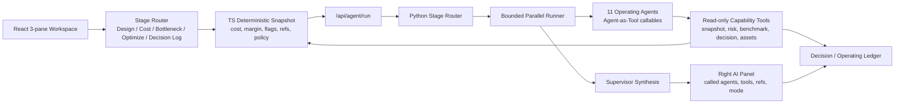

# Operating Team Runtime Remaining Scope Implementation Plan

> **For agentic workers:** REQUIRED SUB-SKILL: Use superpowers:subagent-driven-development (recommended) or superpowers:executing-plans to implement this plan task-by-task. Steps use checkbox (`- [ ]`) syntax for tracking.

**Goal:** Finish AgentCost as an AI operating team where 11 Operating Agents route, inspect deterministic snapshots, retrieve evidence, synthesize recommendations, and preserve decision history.

**Architecture:** The product uses a hybrid `Stage Router -> Bounded Parallel Operating Agents -> Supervisor Synthesis` runtime. TypeScript remains the numeric authority and produces a fresh deterministic snapshot per run; Python LangChain 1.0 agents use read-only capability tools to inspect that snapshot, risk/evidence/assets, and decision history.

**Tech Stack:** Vite 6, React 18, TypeScript 5, Vitest, FastAPI, LangChain Python 1.0 `create_agent`, Pydantic contracts, existing TS deterministic cost/margin engines.

---

## Current Architecture



## Current Implemented Surfaces

- `agent_service/agentic_runtime.py`: 11 Operating Agent ids, stage routing, permission matrix, read-only capability tools, fallback response, provider-backed bounded parallel run, supervisor merge.
- `agent_service/schemas.py`: canonical `AgentRunInput`, `AgenticEvent`, `AgentRunResponse` contract with `agentId`, `calledAgentIds`, `primaryAgentId`, `reviewerAgentIds`, `snapshotVersion`.
- `src/features/agent/lib/agentRunRuntime.ts`: browser-side contract, server POST to `/api/agent/run`, local deterministic fallback preserving agent metadata.
- `src/features/operating-assets/lib/operatingAssets.ts`: 11 Operating Agent profiles, 10 Operating Asset profiles, P1 automation module registry.
- `src/app/App.tsx`: left stage nav and 11 agent list, stage committee / single agent / all-hands calls, right AI panel metadata and tool/ref chips.

---

## Remaining Implementation Scope

### Task 1: Runtime Contract Hardening

**Files:**
- Modify: `agent_service/schemas.py`
- Modify: `src/features/agent/lib/agentRunRuntime.ts`
- Test: `agent_service/tests/test_agentic_runtime.py`
- Test: `src/features/agent/lib/agentRunRuntime.test.ts`

- [ ] **Step 1: Add stricter route and event schema tests**

Add tests that verify:
- every `AgenticEvent` has `agentId`, `calledAgentTool`, `toolResultRefs`, and `snapshotVersion` at response level.
- `executionMode=all_hands` calls exactly 11 agents.
- `single_agent` returns one agent and no reviewers.

- [ ] **Step 2: Make refs non-optional in normalized frontend events**

In `normalizeResponse`, preserve fallback metadata when provider returns partial events. Provider output must never erase `tool:*` refs or `agentId`.

- [ ] **Step 3: Run focused tests**

Run:

```powershell
cd C:\token_simulator
npm run test:run -- src/features/agent/lib/agentRunRuntime.test.ts
cd agent_service
uv run pytest tests/test_agentic_runtime.py
```

Expected: all focused tests pass.

### Task 2: Supervisor Synthesis as First-Class Output

**Files:**
- Modify: `agent_service/agentic_runtime.py`
- Modify: `agent_service/schemas.py`
- Test: `agent_service/tests/test_agentic_runtime.py`

- [ ] **Step 1: Add `supervisorSummary` fields**

Extend `AgentRunResponse` with:
- `supervisorSummary`
- `disagreements`
- `decisionReadiness`
- `nextQuestions`

- [ ] **Step 2: Synthesize across parallel agent results**

In `_merge_agent_responses`, create a summary that names:
- primary agent recommendation
- reviewer risks
- missing snapshot refs
- human decision needed

- [ ] **Step 3: Test fallback and provider paths**

Verify deterministic fallback also returns the same supervisor fields, marked as fallback-generated.

### Task 3: Agent Capability Tool Result Normalization

**Files:**
- Modify: `agent_service/agentic_runtime.py`
- Create: `agent_service/tool_contracts.py`
- Test: `agent_service/tests/test_agentic_runtime.py`

- [ ] **Step 1: Add typed tool result envelopes**

Create a common envelope:

```python
{
  "toolName": "...",
  "refs": ["tool:*", "asset:*", "risk:*"],
  "found": true,
  "data": {...},
  "warnings": []
}
```

- [ ] **Step 2: Wrap every capability tool response**

Update `lookup_snapshot_value`, `retrieve_risk_cards`, `retrieve_benchmark_evidence`, `retrieve_decision_history`, `retrieve_operating_asset`, and registry tools to return this envelope.

- [ ] **Step 3: Test no free-form tool refs**

Tests should fail if a tool returns data without refs or warnings.

### Task 4: Frontend Agent Team UX Completion

**Files:**
- Modify: `src/app/App.tsx`
- Optional create: `src/features/agent/components/OperatingTeamPanel.tsx`
- Test: `src/app/App.test.tsx`

- [ ] **Step 1: Split left Operating Agent list into a focused component**

Move the 11-agent list out of `App.tsx` while preserving behavior:
- click agent -> `single_agent`
- click stage -> `stage_committee`
- full review -> `all_hands`

- [ ] **Step 2: Add route explanation to right panel**

Show:
- why this route was chosen
- primary agent
- reviewers
- execution mode
- snapshot version

- [ ] **Step 3: Add missing-state UI**

If provider returns `snapshot_missing`, render a warning card and do not show fabricated numbers.

### Task 5: Dynamic Snapshot Completeness

**Files:**
- Modify: `src/app/App.tsx`
- Create: `src/features/agent/lib/buildAgentSnapshot.ts`
- Test: `src/features/agent/lib/buildAgentSnapshot.test.ts`

- [ ] **Step 1: Extract snapshot builder**

Move snapshot payload construction out of `App.tsx` into `buildAgentSnapshot`.

- [ ] **Step 2: Include all P0 numeric domains**

Snapshot must include:
- usage logs
- provider/model price refs
- threshold policy
- metric flags
- cost attribution
- margin/profitability
- optimization what-if savings
- decision history

- [ ] **Step 3: Hash snapshot deterministically**

Same input returns same `snapshotVersion`; changed threshold or usage rows produce a new version.

### Task 6: Decision/Operating Ledger Integration

**Files:**
- Modify: `src/features/decision-log/lib/decisionLog.ts`
- Modify: `src/app/App.tsx`
- Test: `src/features/decision-log/lib/decisionLog.test.ts`
- Test: `src/app/App.test.tsx`

- [ ] **Step 1: Store agent route metadata in decisions**

Decision rows should preserve:
- `calledAgentIds`
- `primaryAgentId`
- `reviewerAgentIds`
- `usedCapabilityTools`
- `snapshotVersion`

- [ ] **Step 2: Render route metadata in ledger details**

Decision Log must show which operating team reviewed the recommendation.

- [ ] **Step 3: Preserve old decisions**

Existing local/remote decision rows without metadata should still render with a fallback label.

### Task 7: Real Provider Smoke and Local Browser Smoke

**Files:**
- Modify: `agent_service/scripts/smoke_provider.py`
- Optional create: `docs/runbooks/agent-runtime-smoke.md`

- [ ] **Step 1: Add `/api/agent/run` provider smoke**

Smoke must verify:
- stage committee provider path
- all-hands fallback path
- `tool:*` refs preserved
- no uncited numeric claims

- [ ] **Step 2: Add manual browser smoke runbook**

Runbook should cover:

```powershell
cd C:\token_simulator\agent_service
uv run uvicorn main:app --reload --port 8000

cd C:\token_simulator
$env:VITE_AGENT_RUNTIME="server"
npm run dev
```

Success: SparkClaw sample -> stage routing -> right panel called agents -> Decision Log -> one-page report.

---

## P1 Extension Scope

### P1-A: Full Vector RAG

- Replace lexical/tag retrieval with separated retrievers:
  - official docs RAG
  - benchmark evidence RAG
  - decision history RAG
- Keep numeric authority in structured registries, not vector text.

### P1-B: Official Docs Change Monitor

- Provider/API Agent and Knowledge/Release Ops watch provider docs.
- Human approval updates `provider_registry`.
- Decision Log stores old/new fact-source snapshots.

### P1-C: vLLM / GPU Serving Economics

- Add self-hosted inference inputs:
  - TTFT
  - ITL/TPOT
  - throughput
  - GPU utilization
  - KV cache usage
  - prefix cache hit
  - chunked prefill / continuous batching assumptions
- Keep this separate from provider API pricing.

### P1-D: Alerts and External Mutations

- Slack/Email alerting, Stripe/billing changes, and external doc mutation require:
  - adopted decision
  - rollback plan
  - explicit human approval
  - audit log entry

### P1-E: Multi-Agent Committee Upgrade

- Current P0 runs selected agents and merges results.
- P1 should add explicit:
  - primary agent draft
  - reviewer agent critique
  - supervisor synthesis
  - human approval gate

---

## Verification Gates

- `cd C:\token_simulator\agent_service && uv run pytest`
- `cd C:\token_simulator && npm run test:run`
- `cd C:\token_simulator && npm run build`
- Provider smoke with `OPENAI_API_KEY`
- Browser smoke of SparkClaw demo and all-hands review

