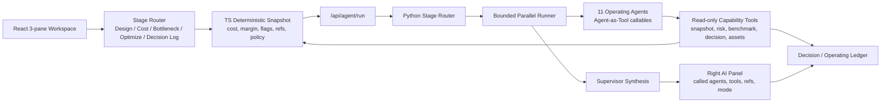

# Operating Team Runtime(운영팀 실행 계층) 남은 범위 구현 계획

> **agentic worker(에이전트형 작업자)용:** REQUIRED SUB-SKILL(필수 하위 스킬): 이 계획을 task-by-task(작업 단위)로 구현하려면 superpowers:subagent-driven-development(권장) 또는 superpowers:executing-plans를 사용한다. 단계 추적은 checkbox(`- [ ]`) 문법을 사용한다.

**목표:** AgentCost를 AI operating team(AI가 역할별 운영팀처럼 움직이는 구조)으로 완성한다. 11개 Operating Agent(운영 에이전트)가 route(작업 배정), deterministic snapshot(같은 입력이면 같은 결과를 내는 분석 데이터 묶음) 검사, evidence(근거) 검색, recommendation(권장안) 합성, decision history(결정 이력) 보존을 수행한다.

**아키텍처:** 제품은 `Stage Router -> Bounded Parallel Operating Agents -> Supervisor Synthesis` hybrid runtime(여러 실행 방식을 섞은 실행 계층)을 사용한다. TypeScript는 numeric authority(숫자 계산 권한)로 남고 실행마다 fresh deterministic snapshot(새 분석 데이터 묶음)을 만든다. Python LangChain 1.0 agent는 read-only capability tool(읽기 전용 기능 도구)로 snapshot, risk/evidence/assets(위험/근거/자산), decision history를 검사한다.

**기술 스택:** Vite 6, React 18, TypeScript 5, Vitest, FastAPI(Python 웹 API 프레임워크), LangChain Python 1.0 `create_agent`, Pydantic contract(Python 데이터 계약), 기존 TS deterministic cost/margin engine(결정적 비용/마진 계산 엔진).

---

## 현재 아키텍처



## 현재 구현된 표면

- `agent_service/agentic_runtime.py`: 11개 Operating Agent id, stage routing(단계별 배정), permission matrix(권한 표), read-only capability tool, fallback response(대체 응답), provider-backed bounded parallel run(제공자 기반 제한 병렬 실행), supervisor merge(감독자 병합).
- `agent_service/schemas.py`: `agentId`, `calledAgentIds`, `primaryAgentId`, `reviewerAgentIds`, `snapshotVersion`을 포함하는 canonical(표준) `AgentRunInput`, `AgenticEvent`, `AgentRunResponse` contract.
- `src/features/agent/lib/agentRunRuntime.ts`: browser-side contract(브라우저 쪽 계약), `/api/agent/run` 서버 POST, agent metadata(에이전트 메타데이터)를 보존하는 local deterministic fallback(로컬 결정적 대체 경로).
- `src/features/operating-assets/lib/operatingAssets.ts`: 11개 Operating Agent profile, 10개 Operating Asset profile, P1 automation module registry(자동화 모듈 목록).
- `src/app/App.tsx`: 왼쪽 stage nav(단계 내비게이션)와 11개 agent list, stage committee / single agent / all-hands 호출, 오른쪽 AI panel metadata와 tool/ref chip.

---

## 남은 구현 범위

### Task 1: Runtime Contract(실행 계약) 강화

**파일:**
- 수정: `agent_service/schemas.py`
- 수정: `src/features/agent/lib/agentRunRuntime.ts`
- 테스트: `agent_service/tests/test_agentic_runtime.py`
- 테스트: `src/features/agent/lib/agentRunRuntime.test.ts`

- [ ] **Step 1: 더 엄격한 route/event schema test 추가**

다음을 검증하는 test를 추가한다.
- 모든 `AgenticEvent`가 `agentId`, `calledAgentTool`, `toolResultRefs`를 가지고, response level(응답 최상위)에 `snapshotVersion`이 있다.
- `executionMode=all_hands`는 정확히 11개 agent를 호출한다.
- `single_agent`는 agent 1개와 reviewer(검토자) 없음으로 반환된다.

- [ ] **Step 2: normalize된 frontend event에서 ref를 필수로 만든다**

`normalizeResponse`에서 provider(LLM 제공자)가 partial event(부분 이벤트)를 반환하더라도 fallback metadata를 보존한다. Provider output(제공자 출력)은 `tool:*` ref 또는 `agentId`를 절대 지우면 안 된다.

- [ ] **Step 3: focused test 실행**

실행:

```powershell
cd C:\token_simulator
npm run test:run -- src/features/agent/lib/agentRunRuntime.test.ts
cd agent_service
uv run pytest tests/test_agentic_runtime.py
```

기대 결과: 모든 focused test가 통과한다.

### Task 2: Supervisor Synthesis(감독자 종합)를 First-Class Output(정식 출력)으로 만들기

**파일:**
- 수정: `agent_service/agentic_runtime.py`
- 수정: `agent_service/schemas.py`
- 테스트: `agent_service/tests/test_agentic_runtime.py`

- [ ] **Step 1: `supervisorSummary` field 추가**

`AgentRunResponse`를 아래 field로 확장한다.
- `supervisorSummary`
- `disagreements`
- `decisionReadiness`
- `nextQuestions`

- [ ] **Step 2: 병렬 agent 결과를 종합**

`_merge_agent_responses`에서 아래를 명시하는 summary(요약)를 만든다.
- primary agent recommendation(주 담당 에이전트 권장안)
- reviewer risk(검토자 위험 지적)
- missing snapshot ref(누락된 스냅샷 참조)
- human decision needed(사람 결정 필요 여부)

- [ ] **Step 3: fallback/provider path 테스트**

deterministic fallback도 같은 supervisor field를 반환하고 fallback-generated(대체 경로 생성)로 표시되는지 검증한다.

### Task 3: Agent Capability Tool Result(에이전트 기능 도구 결과) 정규화

**파일:**
- 수정: `agent_service/agentic_runtime.py`
- 생성: `agent_service/tool_contracts.py`
- 테스트: `agent_service/tests/test_agentic_runtime.py`

- [ ] **Step 1: typed tool result envelope(타입 있는 도구 결과 봉투) 추가**

공통 envelope를 만든다.

```python
{
  "toolName": "...",
  "refs": ["tool:*", "asset:*", "risk:*"],
  "found": true,
  "data": {...},
  "warnings": []
}
```

- [ ] **Step 2: 모든 capability tool response 감싸기**

`lookup_snapshot_value`, `retrieve_risk_cards`, `retrieve_benchmark_evidence`, `retrieve_decision_history`, `retrieve_operating_asset`, registry tool이 이 envelope를 반환하도록 업데이트한다.

- [ ] **Step 3: free-form tool ref(자유형 도구 참조) 금지 테스트**

도구가 ref 또는 warning 없이 data를 반환하면 test가 실패해야 한다.

### Task 4: Frontend Agent Team UX(프론트엔드 에이전트 팀 경험) 완성

**파일:**
- 수정: `src/app/App.tsx`
- 선택 생성: `src/features/agent/components/OperatingTeamPanel.tsx`
- 테스트: `src/app/App.test.tsx`

- [ ] **Step 1: 왼쪽 Operating Agent list를 focused component(전용 컴포넌트)로 분리**

11개 agent list를 `App.tsx` 밖으로 옮기되, 동작은 보존한다.
- click agent -> `single_agent`
- click stage -> `stage_committee`
- full review -> `all_hands`

- [ ] **Step 2: 오른쪽 panel에 route explanation(배정 이유) 추가**

아래를 보여준다.
- 이 route가 선택된 이유
- primary agent
- reviewer
- execution mode(실행 모드)
- snapshot version

- [ ] **Step 3: missing-state UI(누락 상태 화면) 추가**

provider가 `snapshot_missing`을 반환하면 warning card(경고 카드)를 렌더하고 fabricated number(만들어낸 숫자)를 보여주지 않는다.

### Task 5: Dynamic Snapshot Completeness(동적 스냅샷 완전성)

**파일:**
- 수정: `src/app/App.tsx`
- 생성: `src/features/agent/lib/buildAgentSnapshot.ts`
- 테스트: `src/features/agent/lib/buildAgentSnapshot.test.ts`

- [ ] **Step 1: snapshot builder 추출**

snapshot payload construction(스냅샷 요청 본문 구성)을 `App.tsx`에서 `buildAgentSnapshot`으로 옮긴다.

- [ ] **Step 2: 모든 P0 numeric domain(숫자 영역) 포함**

Snapshot에는 아래가 포함되어야 한다.
- usage log(사용량 로그)
- provider/model price ref(제공자/모델 가격 참조)
- threshold policy(기준 정책)
- metric flag(지표 표시)
- cost attribution(비용 귀속)
- margin/profitability(마진/수익성)
- optimization what-if savings(최적화 가정 절감액)
- decision history

- [ ] **Step 3: snapshot을 deterministic하게 hash**

같은 입력은 같은 `snapshotVersion`을 반환한다. threshold 또는 usage row가 바뀌면 새 version을 만든다.

### Task 6: Decision/Operating Ledger 통합

**파일:**
- 수정: `src/features/decision-log/lib/decisionLog.ts`
- 수정: `src/app/App.tsx`
- 테스트: `src/features/decision-log/lib/decisionLog.test.ts`
- 테스트: `src/app/App.test.tsx`

- [ ] **Step 1: decision에 agent route metadata 저장**

Decision row(결정 행)는 아래를 보존해야 한다.
- `calledAgentIds`
- `primaryAgentId`
- `reviewerAgentIds`
- `usedCapabilityTools`
- `snapshotVersion`

- [ ] **Step 2: ledger detail에 route metadata 렌더**

Decision Log는 어떤 operating team이 recommendation을 검토했는지 보여줘야 한다.

- [ ] **Step 3: 기존 decision 보존**

metadata가 없는 기존 local/remote decision row도 fallback label(대체 라벨)과 함께 계속 렌더되어야 한다.

### Task 7: Real Provider Smoke(실제 제공자 간단 점검)와 Local Browser Smoke(로컬 브라우저 간단 점검)

**파일:**
- 수정: `agent_service/scripts/smoke_provider.py`
- 선택 생성: `docs/runbooks/agent-runtime-smoke.md`

- [ ] **Step 1: `/api/agent/run` provider smoke 추가**

Smoke는 아래를 검증해야 한다.
- stage committee provider path(단계 위원회 제공자 경로)
- all-hands fallback path(전체 팀 대체 경로)
- `tool:*` ref 보존
- 근거 없는 숫자 주장 없음

- [ ] **Step 2: manual browser smoke runbook 추가**

Runbook(실행 절차 문서)은 아래를 포함해야 한다.

```powershell
cd C:\token_simulator\agent_service
uv run uvicorn main:app --reload --port 8000

cd C:\token_simulator
$env:VITE_AGENT_RUNTIME="server"
npm run dev
```

성공 기준: SparkClaw sample -> stage routing -> right panel called agents -> Decision Log -> one-page report.

---

## P1 확장 범위

### P1-A: Full Vector RAG(벡터 기반 검색으로 근거 문서를 붙여 답하는 방식)

- lexical/tag retrieval(키워드/태그 검색)을 분리된 retriever(검색기)로 교체한다.
  - official docs RAG
  - benchmark evidence RAG
  - decision history RAG
- numeric authority는 vector text(검색된 문장)가 아니라 structured registry(구조화 목록)에 둔다.

### P1-B: Official Docs Change Monitor(공식 문서 변경 감시)

- Provider/API Agent와 Knowledge/Release Ops가 provider docs(제공자 문서)를 감시한다.
- Human approval이 `provider_registry`를 업데이트한다.
- Decision Log는 old/new fact-source snapshot(이전/이후 사실 출처 묶음)을 저장한다.

### P1-C: vLLM / GPU Serving Economics(자체 GPU 추론 경제성)

- self-hosted inference input(직접 운영 추론 입력)을 추가한다.
  - TTFT
  - ITL/TPOT
  - throughput
  - GPU utilization
  - KV cache usage
  - prefix cache hit
  - chunked prefill / continuous batching assumptions
- 이 영역은 provider API pricing(제공자 API 요금)과 분리한다.

### P1-D: Alert(알림)와 External Mutation(외부 변경)

- Slack/Email alerting, Stripe/billing change, external doc mutation에는 아래가 필요하다.
  - adopted decision(채택된 결정)
  - rollback plan(되돌리기 계획)
  - explicit human approval(명시적 사람 승인)
  - audit log entry(감사 로그 항목)

### P1-E: Multi-Agent Committee(다중 에이전트 위원회) 업그레이드

- 현재 P0는 선택된 agent를 실행하고 결과를 병합한다.
- P1은 아래를 명시적으로 추가해야 한다.
  - primary agent draft(주 담당 에이전트 초안)
  - reviewer agent critique(검토 에이전트 비평)
  - supervisor synthesis(감독자 종합)
  - human approval gate(사람 승인 게이트)

---

## 검증 게이트

- `cd C:\token_simulator\agent_service && uv run pytest`
- `cd C:\token_simulator && npm run test:run`
- `cd C:\token_simulator && npm run build`
- `OPENAI_API_KEY`를 사용한 Provider smoke
- SparkClaw demo와 all-hands review의 Browser smoke
