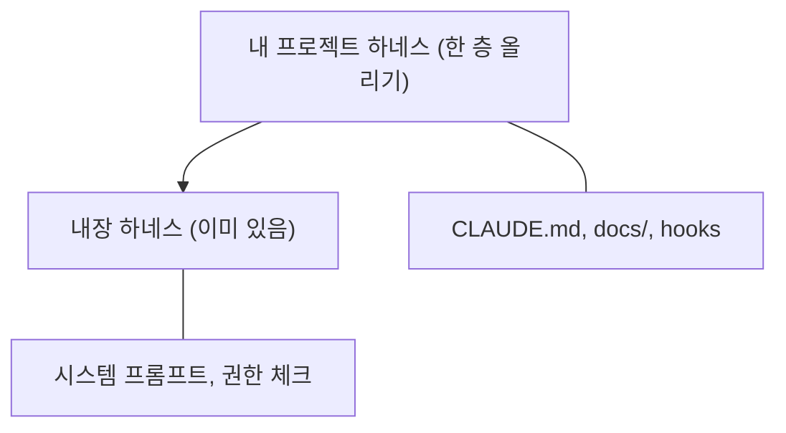
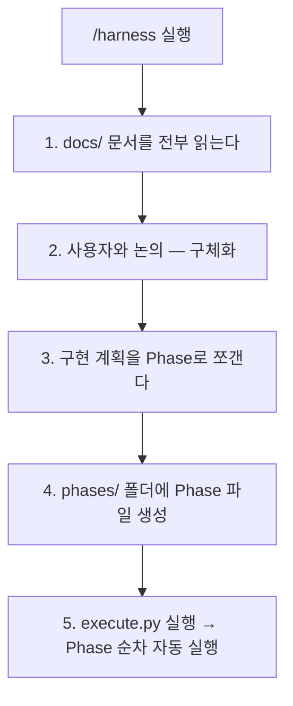
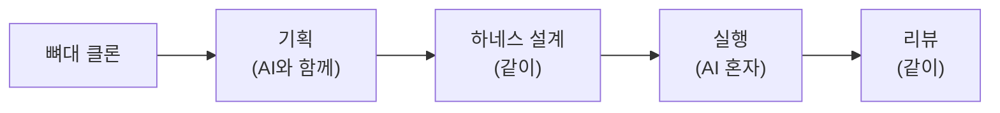

# 하네스 프레임워크 튜토리얼 가이드

---

## 하네스 프레임워크란?

<aside>
💡

**하네스(Harness)**는 AI 코딩 도구가 내 프로젝트 규칙을 따르도록 제어하는 구조화된 프레임워크입니다. Claude Code 위에 "한 층"을 올려서 바이브 코딩의 품질을 높여줍니다.

</aside>

AI 코딩 도구(Claude Code, Cursor, Codex 등)에는 이미 **내장 하네스**가 있습니다 — 위험한 git 명령 차단, 권한 체크, 도구 경계 설정 등. 하지만 이것은 **범용**이라 내 프로젝트만의 아키텍처, 기술 스택, 코딩 규칙은 모릅니다.

이 프레임워크는 그 위에 **프로젝트 전용 하네스**를 올려줍니다:



---

## GitHub 레포지토리

<aside>
📦

**GitHub**: (http://github.com/jha0313/harness_framework)

</aside>

---

## 프레임워크 구조 (4개 레이어)

```
project/
├── CLAUDE.md                    ← 프로젝트 헌법
├── docs/
│   ├── PRD.md                   ← 뭘 만드는지
│   ├── ARCHITECTURE.md          ← 어떻게 만드는지
│   ├── ADR.md                   ← 왜 이렇게 만드는지
│   └── UI_GUIDE.md              ← 어떻게 보여야 하는지 (선택)
├── .claude/
│   ├── commands/
│   │   ├── harness.md           ← /harness — 원스톱 실행
│   │   └── review.md            ← /review — 규칙 기반 리뷰
│   └── settings.json            ← hooks 설정
├── scripts/
│   ├── execute.py               ← Phase 순차 실행 + 상태 관리
│   └── hooks/
│       ├── tdd-guard.sh         ← 테스트 없으면 구현 차단
│       ├── dangerous-cmd-guard.sh ← 위험 명령어 차단
│       └── circuit-breaker.sh   ← 반복 에러 감지
└── phases/                      ← Phase 파일 + 실행 상태
```

---

# Layer 1: docs/ — 프로젝트의 뇌

<aside>
🧠

프레임워크의 핵심입니다. 마크다운 3~4개 파일만 채우면 됩니다.

</aside>

## [PRD.md](http://PRD.md) — 뭘 만드는지

Product Requirements Document. **핵심 기능**과 **MVP 제외 사항**을 정의합니다.

- [PRD.md](http://PRD.md) 템플릿
    
    ```markdown
    # PRD: {프로젝트명}
    
    ## 목표
    {한 줄 요약}
    
    ## 핵심 기능
    1. {기능 1}
    2. {기능 2}
    3. {기능 3}
    
    ## MVP 제외 사항
    - {안 만들 것 1}
    - {안 만들 것 2}
    ```
    

<aside>
⚠️

**MVP 제외 사항**이 매우 중요합니다. 이걸 안 써놓으면 AI가 "이 기능도 추가할까요?" 하면서 scope가 끝없이 늘어납니다. "이건 안 만든다"를 명시하는 게 "이건 만든다"보다 더 중요할 때가 많습니다.

</aside>

## [ARCHITECTURE.md](http://ARCHITECTURE.md) — 어떻게 만드는지

디렉토리 구조, 디자인 패턴, 데이터 흐름을 정의합니다.

- [ARCHITECTURE.md](http://ARCHITECTURE.md) 템플릿
    
    ```markdown
    # 아키텍처
    
    ## 디렉토리 구조
    {폴더 트리}
    
    ## 패턴
    {사용하는 디자인 패턴}
    
    ## 데이터 흐름
    {데이터가 어떻게 흐르는지}
    ```
    

## [ADR.md](http://ADR.md) — 왜 이렇게 만드는지

Architecture Decision Records. **"뭘 선택했고, 왜 선택했고, 뭘 포기했는지"** 세 줄을 적습니다.

- [ADR.md](http://ADR.md) 템플릿
    
    ```markdown
    # Architecture Decision Records
    
    ### ADR-001: {결정 사항}
    **결정**: {뭘 선택했는지}
    **이유**: {왜 선택했는지}
    **트레이드오프**: {뭘 포기했는지}
    ```
    

<aside>
💡

**트레이드오프가 핵심입니다.** 예: "Recharts를 선택했다. D3.js 대비 커스터마이징이 제한되지만 대시보드 수준에서는 충분하다" → AI가 나중에 "D3.js로 바꿀까요?" 같은 제안을 하지 않습니다.

</aside>

## UI_[GUIDE.md](http://GUIDE.md) — 어떻게 보여야 하는지 (선택)

색상 팔레트, 컴포넌트 패턴, **AI 슬롭 안티패턴**(glass morphism 남용, 보라색 그라데이션 텍스트, 네온 글로우 등)을 명시합니다.

<aside>
⚠️

**UI 가이드 없이 실행하면** AI가 기본 스타일 그대로 출력합니다. 디자인 품질을 원한다면 반드시 작성하세요.

</aside>

---

# Layer 2: [CLAUDE.md](http://CLAUDE.md) — 프로젝트의 헌법

AI가 코딩할 때 **제일 먼저 읽는 파일**입니다.

- [CLAUDE.md](http://CLAUDE.md) 템플릿
    
    ```markdown
    # 프로젝트: {프로젝트명}
    
    ## 기술 스택
    - {프레임워크}
    - {언어}
    - {주요 라이브러리}
    
    ## 아키텍처 규칙
    - CRITICAL: {절대 지켜야 할 규칙 1}
    - CRITICAL: {절대 지켜야 할 규칙 2}
    - {일반 규칙들}
    
    ## 개발 프로세스
    - CRITICAL: 새 기능 구현 시 반드시 테스트를 먼저 작성하고, 테스트가 통과하는 구현을 작성할 것 (TDD)
    - 커밋 메시지는 conventional commits 형식을 따를 것
    
    ## 명령어
    {빌드, 테스트, 린트 명령어}
    ```
    

<aside>
🔑

**핵심 포인트 2가지:**

1. **CRITICAL 키워드** — AI가 우선순위 신호로 인식하여 일반 규칙보다 훨씬 강하게 따릅니다
2. **TDD 규칙** — "테스트를 먼저 작성하라" 하나만 넣어도 코드 품질이 크게 올라갑니다
</aside>

---

# Layer 3: 실행 엔진 — /harness + [execute.py](http://execute.py)

## /harness 스킬

`.claude/commands/harness.md`에 정의된 원스톱 실행 스킬입니다. Claude Code에서 `/harness`를 입력하면 실행됩니다.

### 실행 흐름



<aside>
✅

**여러분이 할 일은 docs/ 채우고 `/harness` 치는 것뿐입니다.** 나머지는 프레임워크가 알아서 합니다.

</aside>

## [execute.py](http://execute.py) — Phase 순차 실행

`scripts/execute.py`는 Phase를 순차적으로 실행하는 자동화 스크립트입니다.

### 동작 방식

1. `phases/{task-name}/` 폴더에서 다음 **pending** Phase를 찾는다
2. Phase 파일 내용을 읽어서 Claude에게 넘긴다 (`claude -p` 헤드리스 모드)
3. Claude가 작업을 완료하면 **상태를 체크**한다

| 상태 | 동작 |
| --- | --- |
| completed | 자동 커밋 → 다음 Phase로 |
| error | 에러 기록 + 중단 |
| blocked | 사용자 개입 필요 + 중단 |

### 헤드리스 모드 (`claude -p`)

Claude Code의 자동화 전용 모드입니다. 프롬프트를 텍스트로 넘기면 Claude가 알아서 실행하고 결과를 돌려줍니다.

**대화형 모드** (평소 사용)

- 사람이 채팅하며 주고받기
- 실시간 상호작용

**헤드리스 모드** (`claude -p`)

- 프롬프트 넣으면 알아서 실행
- 사람이 앞에 없어도 됨
- 자동화에 특화

<aside>
💡

[execute.py](http://execute.py)는 Phase마다 **새로운 Claude를 호출**합니다. Phase 1이 끝나면 그 Claude는 종료되고, Phase 2는 새로운 Claude가 시작됩니다. 각 Phase 지시서에 작업 범위가 문서로 제한되어 있으므로 AI가 자기 범위 밖의 일을 하지 않습니다.

</aside>

### 실행 예시

```bash
python3 scripts/execute.py mvp
```

```
==================================================
  Harness Executor
  Task: mvp | Phases: 5 | Pending: 5
==================================================
  ✓ Phase 1: 프로젝트-초기화 [180s]
  ✓ Phase 2: 타입-+-유틸리티 [300s]
  ✓ Phase 3: api-라우트 [240s]
  ✓ Phase 4: ui-컴포넌트 [300s]
  ✓ Phase 5: 메인-페이지-통합 [150s]
==================================================
  Task 'mvp' completed!
==================================================
```

## /review 스킬

프로젝트 규칙에 맞춰 **자동 리뷰**해주는 스킬입니다. 다음 4가지를 자동 체크합니다:

1. [ARCHITECTURE.md](http://ARCHITECTURE.md) 폴더 구조 준수 여부
2. ADR 기술 스택 준수 여부
3. 테스트 작성 여부
4. [CLAUDE.md](http://CLAUDE.md) CRITICAL 규칙 준수 여부

---

# Layer 4: Hooks — 자동 검증 장치

`.claude/settings.json`에 설정하는 자동 검증 스크립트입니다.

| Hook | 기능 | 파일 |
| --- | --- | --- |
| **TDD Guard** | 구현 파일 수정 시 해당 테스트가 없으면 수정을 차단 | `scripts/hooks/tdd-guard.sh` |
| **Dangerous Command Guard** | `rm -rf`, force push, `git reset --hard` 등 위험 명령어 차단 | `scripts/hooks/dangerous-cmd-guard.sh` |
| **Circuit Breaker** | 같은 에러가 60초 안에 5번 반복되면 전략 변경 경고 | `scripts/hooks/circuit-breaker.sh` |

---

# 빠른 시작 가이드

## Step 1: 클론 + 셋업

```bash
git clone https://github.com/jha0313/harness_framework.git my-project
cd my-project
npm install
```

## Step 2: docs/ 채우기 (AI와 함께)

Claude Code를 열고 AI와 대화하며 docs/를 채웁니다.

```
나: "YouTube URL 넣으면 댓글 수집해서 감성 분석하는 대시보드 만들자"
AI: PRD 초안 제안 → 핵심 기능, MVP 제외사항 정리
나: "댓글은 최대 100개로 제한하자."
AI: PRD 수정 → ARCHITECTURE.md, ADR.md도 함께 작성
```

<aside>
💡

혼자 다 쓰는 게 아니라 **AI와 함께 기획**하세요. AI가 놓치기 쉬운 부분을 짚어줍니다.

</aside>

## Step 3: [CLAUDE.md](http://CLAUDE.md)에 CRITICAL 규칙 추가

프로젝트에 맞는 절대 규칙을 넣습니다. 예시:

- `CRITICAL: 모든 API 로직은 app/api/에서만`
- `CRITICAL: API 키는 환경변수로, 코드에 하드코딩 금지`
- `CRITICAL: 새 기능은 테스트 먼저 (TDD)`

## Step 4: 환경변수 설정

프로젝트에 필요한 API 키 등을 `.env.local`에 설정합니다.

```bash
echo "NEXT_PUBLIC_YOUTUBE_API_KEY=your_key
NEXT_PUBLIC_CLAUDE_API_KEY=your_key" > .env.local
```

## Step 5: /harness 실행

Claude Code에서 `/harness`를 입력합니다. AI가 docs/를 읽고 Phase로 분리한 구현 계획을 제안합니다.

## Step 6: [execute.py](http://execute.py)로 자동 실행 (옵셔널)

<aside>
ℹ️

**이 단계는 선택사항입니다.** `/harness` 스킬이 [execute.py](http://execute.py) 실행까지 포함하고 있으므로, Step 5에서 `/harness`를 실행했다면 이 단계를 건너뛰어도 됩니다. 별도로 Phase만 다시 실행하고 싶을 때 사용하세요.

</aside>

```bash
python3 scripts/execute.py mvp
```

## Step 7: 리뷰 + 개선

완성된 결과물을 확인하고, 부족한 부분이 있다면 docs/를 보강한 뒤 다시 실행합니다.

---

# 핵심 교훈

<aside>
🎯

**하네스에 뭘 넣느냐 = 결과의 품질**

프레임워크가 아무리 좋아도 docs가 얕으면 결과도 얕습니다. 코드를 직접 고치는 게 아니라, **AI에게 주는 맥락의 품질을 올리는 것**이 핵심입니다.

</aside>

### 실전 사례: FeedbackPulse

| 문제 | 원인 | 해결 |
| --- | --- | --- |
| UI가 허접하다 | UI 디자인 가이드가 없었음 | `docs/UI_GUIDE.md` 추가 (안티슬롭 패턴 포함) |
| Claude API 파싱 에러 | JSON 응답에서 코드블록 래핑 미처리 | `ADR-009` 추가: 코드블록 strip 규칙 |

→ 같은 프레임워크, 같은 Phase 구조에서 **docs에 가이드 하나 추가했을 뿐**인데 결과물이 확 달라짐

---

# 실전 사례: LLM Cost Simulator

<aside>
📌

**상황**: 라이브 사이트(`https://llm-costsim-aulvsefh.manus.space/`) 조사만으로 16개 개선 티켓(`llm-costsim-issues-v2.md`)을 작성한 상태. **소스 코드 접근 불가**, 번들 분석/DOM 검사/네트워크 트레이스가 유일한 근거. 이 상황에서 하네스 4레이어를 어떻게 채우는지 끝까지 보여줍니다.

</aside>

많은 팀이 완벽한 내부 문서 없이 시작합니다 — 레거시/외주/인수인계 코드. 이 사례는 그 조건에서 하네스를 세우는 전형입니다.

**입력 재료 3가지:**

- 16개 티켓 (v1의 11개 + v2의 PM 페르소나 티켓 5개)
- 2개 페르소나 (Developer, PM/CEO — Enterprise-procurement은 명시 제외)
- 2주 실행 플랜 (v2 문서 내 포함)

이걸로 docs → CLAUDE.md → Phase → Hooks 순으로 채웁니다.

---

## Layer 1: docs/ 채우기

### PRD.md — v2 티켓에서 직접 파생

```markdown
# PRD: LLM Cost Simulator

## 목표
OpenAI, Claude, Gemini, Grok, Copilot의 API 비용을
두 페르소나(Developer, PM/CEO) 모두에게 의사결정 가능하게 보여주는 도구.
스티커 가격이 아니라 **실질 비용** — caching, batch, 실제 워크로드 반영.

## 핵심 기능
1. Quick Calc (개발자) — 프롬프트 붙여넣기 → 실시간 토큰 + 비용
2. Monthly Simulator (PM/CEO) — 월간/시나리오/마이그레이션/export
3. Dual Hero — 페르소나별 진입점 분기 (티켓 #15)
4. Workload presets 6종 + caching/batch 토글 (티켓 #5)
5. Recommendations — 현재 설정 기반 "왜" 설명 포함 (티켓 #8)

## MVP 제외 사항
- Custom Models 팀 공유 / JSON import-export (티켓 #10, P3)
- Share URL 가시화 모달 (티켓 #11, P3)
- Enterprise-procurement 페르소나 (v2 명시 제외)
- 실시간 가격 API 연동 (하드코딩 유지, 분기별 수동 갱신)
```

<aside>
⚠️

MVP 제외 사항 4개를 명시했습니다. 이걸 안 쓰면 Phase 실행 중 "팀 공유도 같이 만들까요?" 같은 scope creep이 발생합니다. 특히 **"안 만든다"** 를 적는 게 핵심.

</aside>

### ARCHITECTURE.md — 번들 분석에서 역산

```markdown
# 아키텍처

## 스택 (번들 분석 기반)
- Build: Vite  (번들 해시 패턴 `index-Dunnx39z.js`)
- UI: React
- 차트: Recharts  (SVG path 구조로 확인)
- 상태: 로컬 상태 + localStorage (Custom Models)
- i18n: 커스텀 딕셔너리 (en/ko)
- 서버: 없음 (가격 요청 0건)

## 디렉토리 구조 (제안)
src/
├── data/
│   ├── models.ts            ← 모델 정의 (releaseDate 필수)
│   └── presets.ts           ← 6개 workload presets
├── lib/
│   ├── pricing.ts           ← computeEffectivePrice() — 단일 진실
│   ├── tokenizer.ts         ← js-tiktoken 래퍼
│   └── i18n.ts              ← doNotTranslate 리스트 포함
├── components/
│   ├── Hero.tsx             ← Dual CTA (#15)
│   ├── QuickCalc/
│   ├── Monthly/
│   │   ├── SummaryCard.tsx          ← #16
│   │   ├── MigrationPanel.tsx       ← #12
│   │   ├── ScenarioTable.tsx        ← #13
│   │   ├── CostBreakdownChart.tsx   ← #1 수정
│   │   └── ExportButton.tsx         ← #14
│   └── Layout.tsx           ← 4탭 헤더 공유 (#9)
└── pages/  (/, /monthly, /recommendations, /custom-models)

## 데이터 흐름
User input → presets + toggles → pricing.ts → 4개 뷰에 동일 수치
Share URL = 현재 state 전체를 base64 query string으로 직렬화
```

### ADR.md — 추론 기반 결정

<aside>
⚠️

**이 섹션의 ADR은 라이브 조사로부터 추론한 결정입니다.** 실제 적용 전 원작자/팀과 확인하세요. 각 ADR에 `⚠️ 추론, 확인 필요` 마커를 붙였습니다.

</aside>

```markdown
# Architecture Decision Records

### ADR-001: 토크나이저는 js-tiktoken (⚠️ 추론, 확인 필요)
**결정**: 클라이언트 사이드 tiktoken을 `tiktoken-wasm` 대신 `js-tiktoken`로.
**이유**: 티켓 #4의 수용기준 "번들 증가 < 1.5MB gzipped" 충족. wasm은 초기 로드 영향.
**트레이드오프**: 속도 ~30% 느리지만 입력 후 200ms 요건 여유 있게 충족.

### ADR-002: Recharts 유지 (⚠️ 추론, 확인 필요)
**결정**: 기존 Recharts에서 Cost Breakdown 차트의 releaseDate 필터만 추가.
**이유**: 번들에서 Recharts 확인. D3 이전 시 재작성 비용 과대.
**트레이드오프**: Dashed/greyed pre-release 구간은 Recharts 기본 아님 → 커스텀 shape 필요.

### ADR-003: localStorage 유지 + 수출 API 추가 (⚠️ 추론, 확인 필요)
**결정**: Custom Models 저장소를 서버로 이전하지 않음.
**이유**: 현재 네트워크 요청 0건 구조 유지. MVP scope 보수.
**트레이드오프**: 팀 공유 불가 → JSON export/import로 우회 (P3).

### ADR-004: i18n doNotTranslate 리스트 방식 (⚠️ 추론, 확인 필요)
**결정**: 번역 제외 어휘를 배열로 관리, 번역 전 치환 토큰으로 감싼다.
**이유**: 전체 i18n 라이브러리 교체보다 패치 비용 낮음.
**트레이드오프**: 15개 모델/5개 프로바이더 기준 수동 유지 감당 가능.

### ADR-005: 가격 계산은 단일 함수 (근거 확정 — v2 #5가 명시)
**결정**: badge (#3), chart (#1), scenario (#13), summary card (#16) 모두
     `computeEffectivePrice(model, tokens, caching, batch)` 하나만 호출.
**이유**: v2 티켓 #5: "badge, scenario, summary card 모두 토글 반영 필수".
     두 페르소나가 보는 숫자가 달라지면 신뢰 붕괴.
**트레이드오프**: 없음.
```

### UI_GUIDE.md — 안티슬롭 + 페르소나 패턴

```markdown
# UI 가이드

## Hero 패턴 (#15)
H1: "LLM pricing, decoded."
Sub: "Real costs — not just sticker prices — with caching, batching, and your actual traffic."
CTA 2개 병렬:
  [ I'm a developer — Quick Calc → ]
  [ I'm planning a budget — Monthly Simulator → ]
한국어: [ 개발자 — 빠른 계산 ] [ 예산 기획 — 월간 시뮬레이터 ]

## Summary Card (#16)
- Monthly 상단 pinned
- 템플릿: {모델} on {호출수/월} ({프리셋}, {cache%}, {batch}) → **${cost}**
          대안 {모델2} → **${cost2}** (−{%})
- "Copy to clipboard" + "Export PNG" 버튼

## Scenario 테이블 (#13)
3열 고정 (Best / Base / Worst), 각 셀 편집 가능, 같은 열만 재계산.

## 안티슬롭 (금지어/금지 패턴)
- "cheapest" 단독 사용 금지 → "Lowest base price" + scope tooltip (#3)
- 브랜드/제품명 번역 금지: Anthropic → 인류 ❌, OpenAI → 오픈아이 ❌ (#6)
- 차트 releaseDate 이전 포인트 렌더 금지 (#1)
- glass morphism, 보라 그라데이션 텍스트, 네온 글로우 금지
```

---

## Layer 2: CLAUDE.md

```markdown
# 프로젝트: LLM Cost Simulator

## 기술 스택
- Vite + React + TypeScript
- Recharts
- js-tiktoken
- 클라이언트 사이드 only (서버 없음)

## 아키텍처 규칙
- CRITICAL: 모든 가격 계산은 `lib/pricing.ts`의 `computeEffectivePrice()` 단일 함수로만.
- CRITICAL: 차트/테이블/카드/배지 어디에서도 `model.releaseDate` 이전 데이터 포인트를 렌더하지 않는다.
- CRITICAL: caching/batch 토글 상태는 badge, chart, scenario, summary card 모두에 반영되어야 한다.
- CRITICAL: 브랜드/제품명은 i18n의 `doNotTranslate` 리스트를 반드시 거친다.
- CRITICAL: "cheapest" 단독 표기 금지 — scope(워크로드/캐시/배치)를 항상 함께 명시.
- 새 workload preset 추가 시 `data/presets.ts` + `docs/UI_GUIDE.md` 동시 업데이트.
- Custom Models 데이터는 서버로 보내지 않는다.

## 개발 프로세스
- CRITICAL: 새 기능은 테스트 먼저 (TDD). `lib/pricing.ts`는 100% 커버리지.
- 커밋 메시지: conventional commits (feat/fix/chore).
- 각 Phase 완료 후 `/review` 실행 → CRITICAL 규칙 위반 0건 확인.

## 명령어
npm run dev | npm run test | npm run lint | npm run build
```

<aside>
🔑

CRITICAL 규칙 5개가 모두 v2 티켓에서 직접 파생됐습니다. 이게 docs와 CLAUDE.md의 관계 — **docs는 무엇을/왜, CLAUDE.md는 절대 지켜야 할 결정을 압축한 헌법**.

</aside>

---

## Layer 3: Phase 분리 (7개)

v2의 2주 플랜을 MVP 권장 규모(5~7개)에 맞춰 7 Phase로 매핑:

| Phase | 이름 | 대상 티켓 | 예상 |
| --- | --- | --- | --- |
| 1 | Data accuracy & persona framing | #1, #3, #9, #15 | 2일 |
| 2 | Token estimator (Dev path) | #4 | 2일 |
| 3 | Caching/batch toggles (Dev path) | #5 | 2일 |
| 4 | Migration comparison (PM path) | #12 | 3일 |
| 5 | Scenario planner (PM path) | #13 | 2일 |
| 6 | Board-ready summary card | #16 | 1일 |
| 7 | Export + 번역/UX 폴리시 | #14, #6, #7, #8, #2 | 2일 |

**왜 7개가 자연스러운가:**

1. 각 Phase가 하나의 **릴리즈 가치 단위** — 단독 배포해도 사용자가 변화를 체감.
2. 의존성이 한 방향 — 5 → 6은 OK(scenario 있어야 summary), 6 → 5은 말이 안 됨.
3. 페르소나 흐름 명확 — P1(공통 trust) → P2-3(Dev) → P4-6(PM) → P7(폴리시).
4. P2/P3는 P4~6과 독립 → 팀이 있으면 병렬 가능.

Phase 파일 예시 (`phases/mvp/phase1.md`):

```markdown
# Phase 1: Data accuracy & persona framing

## 목표
v2 P0 티켓 4개를 처리하여 두 페르소나 모두에게 사실 기반 신뢰를 회복한다.

## 범위 (티켓)
- #1: Cost Breakdown 차트가 releaseDate 이전 데이터를 그리지 않게 수정
- #3: "Cheapest option" 배지 리프레이밍
- #9: /monthly의 4탭 헤더 복구
- #15: Dual Hero CTA 도입

## 작업
1. `lib/pricing.ts`에 `filterByReleaseDate(model, months)` + 테스트
2. `components/Monthly/CostBreakdownChart.tsx` 수정 (pre-release 구간 greyed)
3. `components/Layout.tsx` 추출 → 모든 라우트에서 재사용
4. `components/Hero.tsx` Dual CTA 작성
5. Header badge 문구 변경 + tooltip 추가

## 수용 기준
- [ ] 티켓 #1, #3, #9, #15의 각 acceptance criteria 모두 충족
- [ ] 신규 함수 100% 커버리지
- [ ] `/review` 통과 (CRITICAL 규칙 위반 0건)

## 범위 밖
- Monthly 재설계 전반 (Phase 4~6)
- i18n doNotTranslate (Phase 7)
- 토큰 에스티메이터 (Phase 2)
```

이 스타일로 Phase 1~7을 만들고 `execute.py`가 순차 실행합니다.

<aside>
✅

**티켓 → Phase 변환이 기계적으로 가능**한 이유: v2 티켓이 페르소나 / 우선순위 / 수용기준 3가지를 갖추고 있기 때문. 좋은 티켓 문서 = 좋은 Phase 입력.

</aside>

---

## Layer 4: Hooks

기본 3개 + 프로젝트 전용 1개를 제안합니다.

| Hook | 목적 |
| --- | --- |
| TDD Guard (기본) | `lib/pricing.ts` 수정 시 `lib/pricing.test.ts` 없으면 차단 |
| Dangerous Command Guard (기본) | 표준 |
| Circuit Breaker (기본) | 표준 |
| **Price Integrity Guard (커스텀)** | 차트/테이블/카드/배지 파일에서 가격 계산을 직접 수행하지 못하게 차단 |

`scripts/hooks/price-integrity-guard.sh`:

```bash
#!/bin/bash
# 차트/카드/배지 파일 수정 시 inline 가격 연산을 차단
FILE="$1"
case "$FILE" in
  *Chart.tsx|*Card.tsx|*Badge.tsx|*Scenario*.tsx|*Migration*.tsx)
    if grep -E "(inputPrice|outputPrice)\s*\*" "$FILE" >/dev/null 2>&1; then
      echo "BLOCKED: $FILE contains inline price math."
      echo "Use computeEffectivePrice() from lib/pricing.ts (CLAUDE.md CRITICAL 1)."
      exit 1
    fi
    ;;
esac
exit 0
```

`.claude/settings.json`:

```json
{
  "hooks": {
    "PreToolUse": [
      {
        "matcher": "Edit|Write",
        "command": "scripts/hooks/price-integrity-guard.sh ${file_path}"
      }
    ]
  }
}
```

<aside>
🔒

이 훅 하나로 CRITICAL 규칙 1번(단일 계산 함수)이 **자동 강제**됩니다. 규칙은 3층 방어 — CLAUDE.md(의도) + 테스트(사후 검증) + Hook(사전 차단). 셋 다 있을 때만 실제로 지켜집니다.

</aside>

---

## 이 사례의 교훈

1. **v2 티켓이 곧 Phase가 된다.** 티켓이 페르소나/우선순위/수용기준을 갖추면 Phase 분리가 기계적으로 도출됨. 순서: 조사(v2) → docs → Phase. 티켓 없이 Phase부터 짜면 역순.
2. **PM 페르소나 추가가 ADR을 바꾼다.** v1→v2에서 페르소나가 늘자 ADR-005(단일 계산 함수)가 강제로 등장. Dev와 PM이 보는 숫자가 달라지면 신뢰가 무너지므로. ADR은 기술 결정만이 아니라 **페르소나 간 계약의 기록**.
3. **UI_GUIDE 없으면 안티슬롭이 복귀한다.** "cheapest" 금지어, releaseDate 규칙을 파일로 못 박지 않으면 다음 Phase에서 AI가 기존 패턴으로 되돌아갈 확률이 높음. 규칙은 파일로 적혀야 지켜진다.
4. **조사-only 상태도 하네스 출발점으로 충분.** 소스 접근 없어도 번들 분석 + DOM + i18n 키 + 차트 좌표로 docs 4개가 채워진다. 완벽한 문서를 기다리지 말고, 지금 가진 근거로 시작.

---

## 확장: 팀 프로젝트 구조

튜토리얼의 4레이어에 익숙해지면, 풀 Claude 프로젝트 구조로 점진 확장:

```
project/
├── CLAUDE.md                  ← 팀 공유 (이 튜토리얼 범위)
├── CLAUDE.local.md            ← 개인 오버라이드 (.gitignore)
├── .claude/
│   ├── settings.json          ← 팀 공유 훅/권한
│   ├── settings.local.json    ← 개인 권한 (.gitignore)
│   ├── commands/              ← /harness, /review (이 튜토리얼)
│   ├── rules/                 ← 주제별 세부 규칙
│   │   ├── pricing.md
│   │   ├── i18n.md
│   │   └── testing.md
│   ├── skills/                ← 자동 호출 워크플로
│   │   └── price-audit/       ← 가격 로직 감사 전용
│   └── agents/                ← 격리 서브에이전트
│       ├── code-reviewer.md
│       └── i18n-checker.md
```

| 요소 | 언제 쓰나 |
| --- | --- |
| `CLAUDE.local.md` / `settings.local.json` | 개인 선호(에디터, 자주 쓰는 명령) — 커밋 안 함 |
| `rules/` | `CLAUDE.md`가 무거워질 때 주제별 분리 |
| `skills/` | 특정 트리거에 자동 호출될 긴 워크플로 (예: 가격 파일 수정 시 `price-audit` 자동 실행) |
| `agents/` | 격리 컨텍스트 서브에이전트 (예: `i18n-checker`는 번역 일관성만 본다) |

<aside>
🎯

튜토리얼의 4레이어 = **가장 작은 작동 단위**. 위 구조 = **팀이 커졌을 때의 확장 경로**. 순서는 **먼저 4레이어로 1~2 프로젝트를 끝내본 뒤** rules/agents/skills로 확장하는 것을 권장합니다.

</aside>

---

# 전체 워크플로우 요약



| 단계 | 누가 | 무엇을 |
| --- | --- | --- |
| 뼈대 | 나 | 프레임워크 레포 클론 |
| 기획 | 나 + AI | docs/ 채우기 (PRD, ARCHITECTURE, ADR) |
| 하네스 설계 | 나 + AI | [CLAUDE.md](http://CLAUDE.md) 규칙 + Hooks 설정 |
| 실행 | AI | /harness → [execute.py](http://execute.py) (Phase 순차 실행) |
| 리뷰 | 나 + AI | 결과물 확인 + docs 보강 + 재실행 |

    
- Phase는 몇 개가 적당한가요?
    
    MVP 기준 5~7개가 적당합니다. 너무 많으면 각 Phase가 너무 작아지고, 너무 적으면 한 Phase에 너무 많은 작업이 들어갑니다.
    
- [execute.py](http://execute.py) 실행 중 에러가 나면?
    
    에러 상태가 `phase{N}.status.json`에 기록됩니다. 에러 원인을 확인하고, Phase 지시서를 수정한 뒤 다시 실행하면 해당 Phase부터 재개됩니다.
    